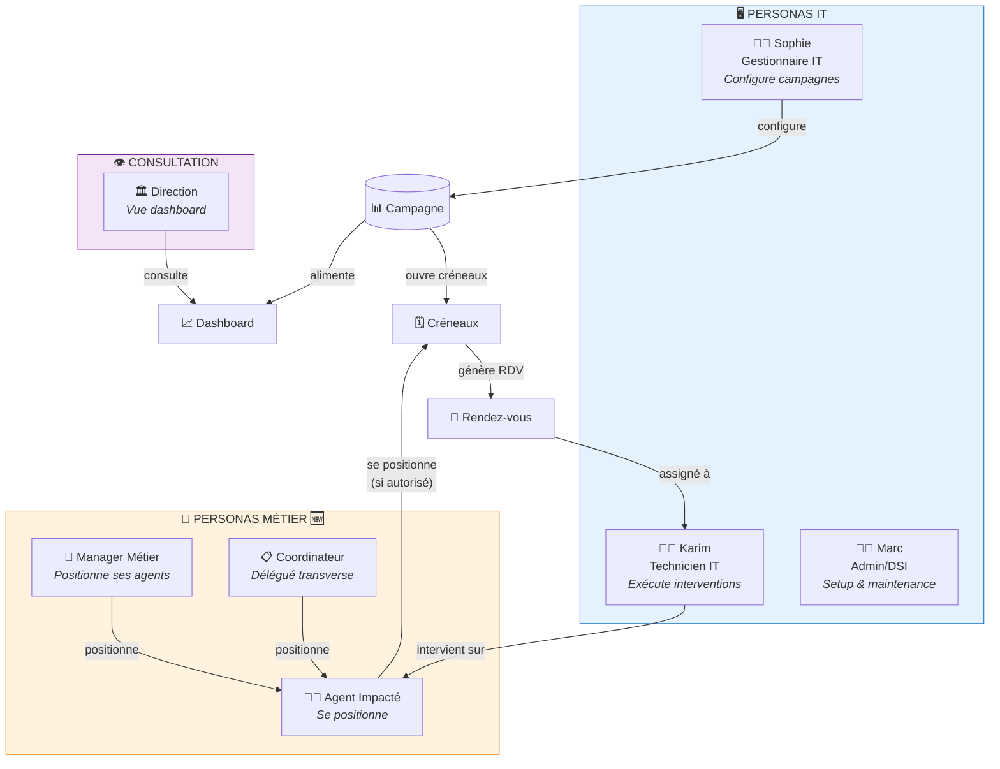
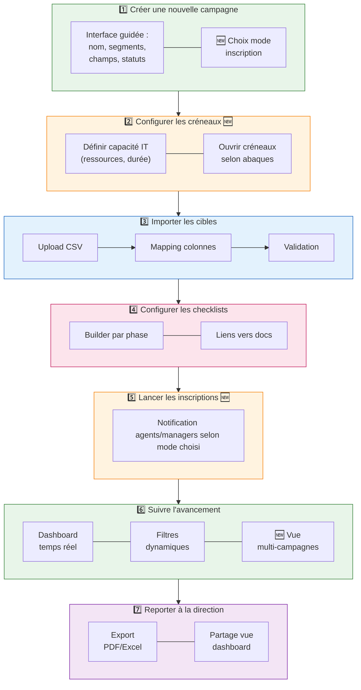
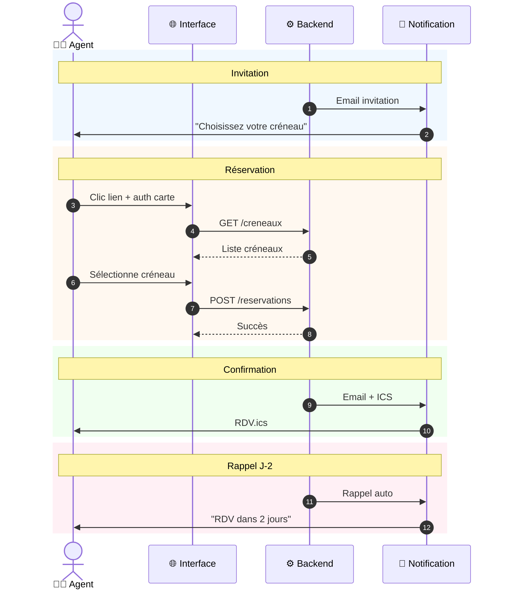
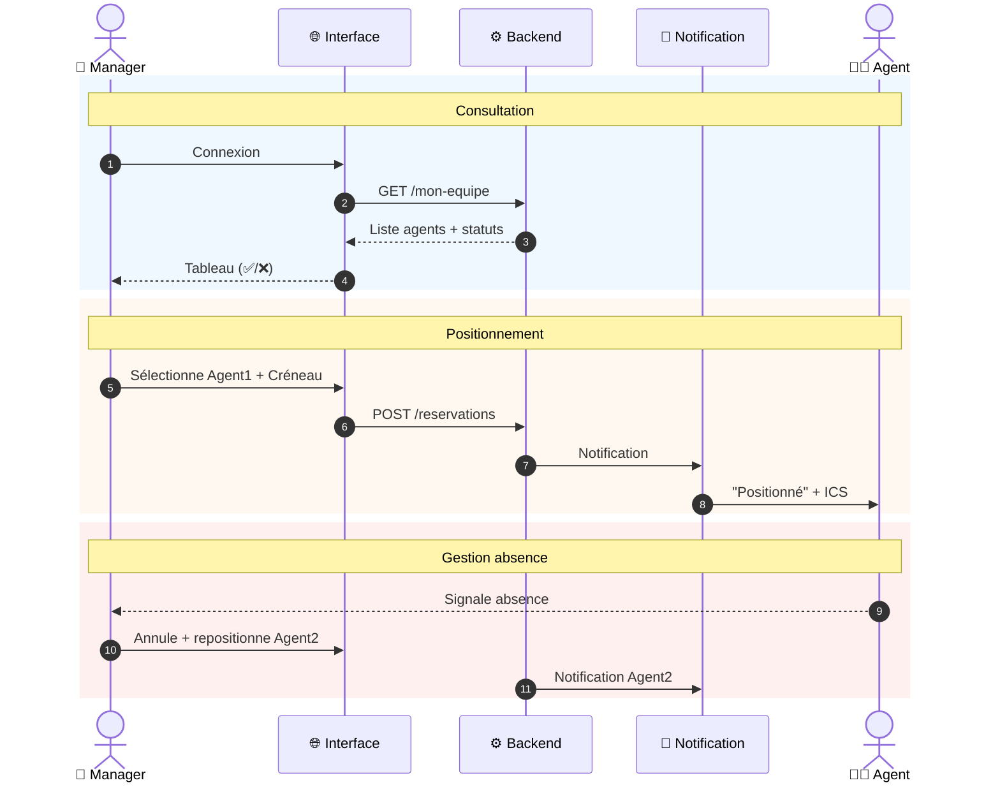
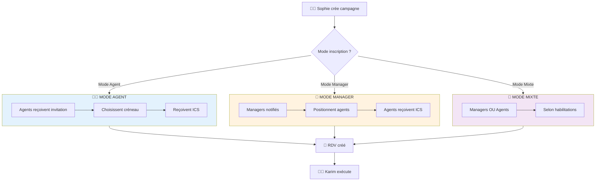

# P1.3 - Personas & Besoins (v2.0)

━━━━━━━━━━━━━━━━━━━━━━━━━━━━━━━━━━━━━━━━━━━━━━━
👥 **PERSONAS & BESOINS — MIS À JOUR** Confiance globale : **95%**
━━━━━━━━━━━━━━━━━━━━━━━━━━━━━━━━━━━━━━━━━━━━━━━

---

## Historique des Modifications

| Version | Date         | Modification                                                      |
| ------- | ------------ | ----------------------------------------------------------------- |
| 1.0     | Janvier 2025 | Version initiale (personas IT)                                    |
| 2.0     | Janvier 2025 | Ajout des personas Métier issus de P1.3bis (réunion utilisateurs) |

---

## Vue d'Ensemble

### Cartographie Complète des Personas

| Rang | Persona                   | Catégorie    | Rôle OpsTracker                                    | Usage                        | Priorité UX                          |
| ---- | ------------------------- | ------------ | -------------------------------------------------- | ---------------------------- | ------------------------------------ |
| 🥇   | **Sophie** (Gestionnaire) | IT           | Configure les campagnes, pilote l'avancement       | Quotidien pendant opérations | **PRIMAIRE** — On optimise pour elle |
| 🥈   | **Karim** (Technicien)    | IT           | Exécute les interventions terrain                  | Intensif pendant opérations  | **CRITIQUE** — Simplicité maximale   |
| 🥈   | **Agent Impacté** 🆕      | Métier       | Se positionne sur un créneau                       | Ponctuel (1-2x/an)           | **CRITIQUE** — Zéro formation        |
| 🥉   | **Manager Métier** 🆕     | Métier       | Positionne ses agents, préserve continuité service | Ponctuel mais intensif       | **HAUTE** — Vue équipe               |
| 4    | **Marc** (Admin/DSI)      | IT           | Setup initial, maintenance                         | Ponctuel (installation)      | Standard                             |
| 5    | **Coordinateur** 🆕       | Métier       | Délégué transverse sans lien hiérarchique          | Ponctuel                     | Moyenne                              |
| 👀   | **Direction**             | Consultation | Consulte les dashboards                            | Ponctuel                     | Consultation seule                   |

> **Note importante** : Dans certaines organisations, une même personne peut cumuler plusieurs rôles (ex: un technicien senior qui fait aussi la gestion). L'interface doit permettre cette polyvalence sans friction.

### Diagramme des Interactions entre Personas



---

## PERSONA PRIMAIRE : Sophie, Gestionnaire d'Opérations

### 1. Profil & Contexte

- **Qui est-ce ?** : Coordinatrice IT ou cheffe de projet technique, 35-50 ans. Profil organisé, méthodique, souvent "couteau suisse" de l'équipe. Bonne maîtrise d'Excel mais consciente de ses limites. Frustrée de passer plus de temps à consolider qu'à piloter.
- **Son quotidien (AS-IS)** : Crée le fichier Excel de suivi au démarrage de chaque opération. Dispatch les cibles aux techniciens par mail. Relance ceux qui n'ont pas mis à jour. Fusionne les retours manuellement avec gestion des conflits de version. Génère des graphiques PowerPoint pour les points direction. Archive le fichier à la fin... jusqu'à la prochaine opération où elle recommence de zéro.
- **Fréquence** : 2 à 4 opérations par an (jusqu'à 10 dans les années chargées)
- **Objectifs clés** :
  - Avoir une vision fiable de l'avancement en temps réel
  - Anticiper les blocages avant qu'ils ne deviennent critiques
  - Produire des reportings propres sans y passer des heures
  - Capitaliser sur les opérations précédentes (templates, structures)

### 2. Jobs-to-be-Done

| Type               | Job                                                                  |
| ------------------ | -------------------------------------------------------------------- |
| 🛠 **Fonctionnel** | Piloter l'avancement de l'opération et identifier les écarts au plan |
| ❤️ **Émotionnel**  | Se sentir sereine face aux demandes de reporting, pas stressée       |
| 🤝 **Social**      | Être vue comme une gestionnaire efficace qui maîtrise ses opérations |

### 3. Frustrations & Douleurs

| Sévérité | Frustration                                            | Cause racine                                                                  |
| -------- | ------------------------------------------------------ | ----------------------------------------------------------------------------- |
| 🔴       | **"Je passe plus de temps à consolider qu'à piloter"** | Fusion manuelle de multiples fichiers Excel, gestion des conflits de versions |
| 🔴       | **"Je ne sais jamais si les données sont à jour"**     | Pas de timestamp, pas de traçabilité qui a modifié quoi et quand              |
| 🟠       | **"Chaque opération, je repars de zéro"**              | Aucun template réutilisable, aucune capitalisation                            |
| 🟠       | **"Les dashboards direction, c'est du bricolage"**     | Graphiques PowerPoint manuels, pas de widgets temps réel                      |

### 4. Matrice des Besoins

| Type             | Le besoin (Solution Agnostic)                                                          | Priorité        |
| ---------------- | -------------------------------------------------------------------------------------- | --------------- |
| **Explicite**    | "Je veux un dashboard qui me montre l'avancement par statut/site/technicien"           | Must Have       |
| **Explicite**    | "Je veux configurer une nouvelle campagne directement dans l'app, sans aide technique" | Must Have       |
| **Explicite**    | "Je veux pouvoir exporter un reporting propre en 2 clics"                              | Should Have     |
| **Explicite** 🆕 | "Je veux définir le mode d'inscription (agents autonomes ou managers)"                 | Must Have       |
| **Explicite** 🆕 | "Je veux gérer plusieurs campagnes en parallèle avec une vue globale"                  | Must Have       |
| **Implicite**    | Que les données soient à jour sans que j'aie à relancer les techniciens                | Must Have       |
| **Implicite**    | Que la configuration soit intuitive (pas de formation longue)                          | Must Have       |
| **Implicite** 🆕 | Que les créneaux soient dimensionnés selon mes ressources IT                           | Should Have     |
| **Latent**       | Pouvoir dupliquer/réutiliser la structure d'une opération pour la suivante             | Should Have     |
| **Latent**       | Comparer les métriques entre opérations pour identifier des patterns                   | Could Have (V2) |

### 5. Parcours Utilisateur Cible (TO-BE)

```
1. Créer une nouvelle campagne
   └─ Interface guidée : nom, segments, champs custom, statuts
   └─ 🆕 Choix du mode d'inscription (agent/manager/mixte)

2. Configurer les créneaux 🆕
   └─ Définir capacité IT (ressources, durée intervention)
   └─ Ouvrir les créneaux selon abaques

3. Importer les cibles
   └─ Upload CSV → Mapping visuel des colonnes → Validation

4. Configurer les checklists
   └─ Builder par phase, liens vers docs

5. Lancer les inscriptions 🆕
   └─ Notification aux agents ou managers selon mode choisi

6. Suivre l'avancement
   └─ Dashboard temps réel, filtres dynamiques
   └─ 🆕 Vue multi-campagnes si plusieurs en parallèle

7. Reporter à la direction
   └─ Export PDF/Excel ou partage de vue dashboard
```



---

## PERSONA CRITIQUE : Karim, Technicien IT Terrain

### 1. Profil & Contexte

- **Qui est-ce ?** : Technicien informatique de proximité, 28-45 ans. Profil pragmatique et orienté action. À l'aise avec les outils numériques (c'est son métier), mais allergique à la bureaucratie inutile. Préfère un outil qui "juste marche" plutôt qu'une usine à gaz.
- **Son quotidien (AS-IS)** : Jongle entre plusieurs fichiers Excel partagés (souvent avec des versions conflictuelles). Reçoit ses affectations par mail ou Teams. Note ses interventions sur son laptop, parfois en décalé. Consulte des procédures en PDF qu'il doit ouvrir à côté de son Excel. En fin de journée, doit reporter manuellement ses avancements dans le fichier "maître" — quand il n'oublie pas.
- **Contrainte critique** : Travaille sur laptop en mobilité. L'interface doit être **utilisable sans formation** et **tout-en-un** (pas de navigation entre apps).
- **Objectifs clés** :
  - Réaliser ses interventions dans les temps
  - Ne pas avoir à redemander les infos (procédures, contacts, créneaux)
  - Être reconnu comme efficace par sa hiérarchie

### 2. Jobs-to-be-Done

| Type               | Job                                                                                 |
| ------------------ | ----------------------------------------------------------------------------------- |
| 🛠 **Fonctionnel** | Savoir exactement quoi faire, où, quand, et dans quel ordre — sans avoir à fouiller |
| ❤️ **Émotionnel**  | Se sentir organisé et en contrôle de sa journée, pas submergé                       |
| 🤝 **Social**      | Être perçu comme fiable et réactif par ses collègues et sa hiérarchie               |

### 3. Frustrations & Douleurs

| Sévérité | Frustration                                      | Cause racine                                                                                                    |
| -------- | ------------------------------------------------ | --------------------------------------------------------------------------------------------------------------- |
| 🔴       | **"Je perds du temps à chercher mes infos"**     | Données dispersées (mail, Excel, Teams, PDF). Aucune source unique de vérité.                                   |
| 🔴       | **"Les checklists, c'est inutilisable"**         | Procédures en PDF statique, pas de suivi d'avancement, impossible de savoir où j'en suis si je suis interrompu. |
| 🟠       | **"Je dois tout reporter 2 fois"**               | Mise à jour locale + fichier partagé = double saisie et risque d'oubli.                                         |
| 🟠       | **"On me change mes créneaux sans me prévenir"** | Pas de notification, pas de vue temps réel de son planning.                                                     |

### 4. Matrice des Besoins

| Type          | Le besoin (Solution Agnostic)                                                       | Priorité    |
| ------------- | ----------------------------------------------------------------------------------- | ----------- |
| **Explicite** | "Je veux voir mes interventions du jour avec toutes les infos au même endroit"      | Must Have   |
| **Explicite** | "Je veux cocher mes étapes au fur et à mesure et accéder aux docs facilement"       | Must Have   |
| **Implicite** | Que mes mises à jour soient instantanément visibles par tous (pas de resync manuel) | Must Have   |
| **Implicite** | Que l'interface soit utilisable en 5 minutes sans formation                         | Must Have   |
| **Latent**    | Ne plus avoir à reporter quoi que ce soit — que le système trace automatiquement    | Should Have |

### 5. Critères UX Non-Négociables

| Critère                               | Justification                                              |
| ------------------------------------- | ---------------------------------------------------------- |
| **⚡ Temps de prise en main < 5 min** | Pas de budget formation, l'outil doit être évident         |
| **📱 Interface tout-en-un**           | Pas de navigation entre apps/onglets pour une intervention |
| **✅ Checklist cliquable**            | Cocher = progression visible + accès doc contextuel        |
| **🔄 Synchronisation transparente**   | Pas de "sauvegarder" manuel, tout est temps réel           |
| **🎯 Focus "mes tâches"**             | Vue filtrée par défaut sur ses propres interventions       |

---

## PERSONA CRITIQUE 🆕 : Agent Impacté (End-User Métier)

> **Source** : P1.3bis — Réunion utilisateurs (janvier 2025)

### 1. Profil & Contexte

- **Qui est-ce ?** : Agent organisation (PFS, back-office, médical, RH, etc.) dont le poste ou l'équipement va être impacté par une opération IT. Ce n'est PAS un informaticien, c'est un "client interne" de l'opération.
- **Son quotidien** : Travaille sur son cœur de métier (traitement de dossiers, accueil, téléconseil...). L'opération IT est une perturbation à gérer, pas son activité principale.
- **Contraintes** :
  - Doit continuer à assurer son activité pendant l'opération
  - Fréquence d'usage de l'outil : ponctuel (1-2 fois par an)
  - Compétence numérique : variable (de basique à correcte)
  - Aucune formation possible sur l'outil
- **Objectifs clés** :
  - Choisir un créneau qui ne perturbe pas son activité
  - Être informé clairement de ce qui va se passer
  - Ne pas bloquer ses collègues ou son service

### 2. Jobs-to-be-Done

| Type               | Job                                                                 |
| ------------------ | ------------------------------------------------------------------- |
| 🛠 **Fonctionnel** | Choisir un créneau compatible avec mes contraintes professionnelles |
| ❤️ **Émotionnel**  | Ne pas subir l'opération IT, être acteur de mon planning            |
| 🤝 **Social**      | Ne pas bloquer mon service / mes collègues                          |

### 3. Frustrations & Douleurs (AS-IS)

| Sévérité | Frustration                                                    | Cause racine                                 |
| -------- | -------------------------------------------------------------- | -------------------------------------------- |
| 🔴       | **"On me dit de me rendre disponible mais je sais pas quand"** | Pas de visibilité sur les créneaux possibles |
| 🔴       | **"J'ai raté mon créneau, je savais plus quand c'était"**      | Pas de rappel, pas d'intégration agenda      |
| 🟠       | **"Mon manager décide sans me consulter"**                     | Pas d'interface de self-service              |
| 🟠       | **"Je sais pas ce qui va se passer pendant l'intervention"**   | Pas d'information préalable                  |

### 4. Matrice des Besoins

| Type          | Le besoin (Solution Agnostic)                                      | Priorité    |
| ------------- | ------------------------------------------------------------------ | ----------- |
| **Explicite** | Voir les créneaux disponibles et en choisir un                     | Must Have   |
| **Explicite** | Pouvoir modifier/annuler mon créneau si empêchement                | Must Have   |
| **Implicite** | Recevoir une confirmation + rappel dans mon agenda (ICS)           | Should Have |
| **Implicite** | Interface ultra-simple (pas de formation, usage ponctuel)          | Must Have   |
| **Latent**    | Savoir ce qui va se passer lors de l'intervention (durée, impacts) | Could Have  |

### 5. Critères UX Non-Négociables

| Critère                        | Justification                                     |
| ------------------------------ | ------------------------------------------------- |
| **⚡ Prise en main immédiate** | Usage très ponctuel, pas de formation possible    |
| **🎯 Parcours linéaire**       | Voir créneaux → Choisir → Confirmer (3 clics max) |
| **📱 Responsive**              | Certains agents sont en mobilité                  |
| **🔐 Auth transparente**       | Carte agent = pas de login/mot de passe à retenir |
| **📅 Intégration agenda**      | Fichier ICS pour éviter les oublis                |

### 6. Parcours Utilisateur Cible (TO-BE)



---

## PERSONA HAUTE PRIORITÉ 🆕 : Manager Métier (Encadrant hors IT)

> **Source** : P1.3bis — Réunion utilisateurs (janvier 2025)

### 1. Profil & Contexte

- **Qui est-ce ?** : Responsable d'équipe, chef de service, manager de proximité (PFS, back-office, médical, RH...). Ce n'est PAS un informaticien, il gère une équipe "métier" qui va être impactée par l'opération IT.
- **Son quotidien** : Organise le travail de son équipe, gère les plannings, les absences, la continuité de service. Connaît les contraintes individuelles de chaque agent (présentéisme, activités, compétences).
- **Responsabilité clé** : Préserver la continuité de service de son équipe pendant l'opération IT.
- **Fréquence d'usage** : Ponctuel mais plus intensif que l'agent (doit positionner toute son équipe).
- **Objectifs clés** :
  - Positionner ses agents sans désorganiser le service
  - Pouvoir réagir aux imprévus (absences, urgences)
  - Garder la maîtrise de l'organisation de son équipe

### 2. Jobs-to-be-Done

| Type               | Job                                                                            |
| ------------------ | ------------------------------------------------------------------------------ |
| 🛠 **Fonctionnel** | Positionner mes agents sur des créneaux en préservant la continuité de service |
| 🛠 **Fonctionnel** | Remplacer/repositionner un agent en cas d'absence ou d'imprévu                 |
| ❤️ **Émotionnel**  | Garder le contrôle sur l'organisation de mon service                           |
| 🤝 **Social**      | Être vu comme un manager qui protège son équipe des perturbations              |

### 3. Frustrations & Douleurs (AS-IS)

| Sévérité | Frustration                                                              | Cause racine                                                              |
| -------- | ------------------------------------------------------------------------ | ------------------------------------------------------------------------- |
| 🔴       | **"Pas de vision consolidée créneaux vs disponibilités"**                | Doit croiser manuellement planning équipe et créneaux IT                  |
| 🔴       | **"Risque de désorganisation si agents s'inscrivent sans coordination"** | Tous les agents du même service le même jour = plus personne au téléphone |
| 🟠       | **"Recensement fastidieux par Excel"**                                   | Tableaux Excel à consolider, versions conflictuelles                      |
| 🟠       | **"Quand un agent est absent, je dois penser à prévenir l'IT"**          | Pas de workflow simple pour modifier/annuler                              |

### 4. Matrice des Besoins

| Type          | Le besoin (Solution Agnostic)                                 | Priorité    |
| ------------- | ------------------------------------------------------------- | ----------- |
| **Explicite** | Voir la liste de mes agents et les créneaux disponibles       | Must Have   |
| **Explicite** | Positionner mes agents sur des créneaux (pour eux)            | Must Have   |
| **Explicite** | Modifier/annuler un positionnement si absence                 | Must Have   |
| **Implicite** | Vue synthétique : qui est positionné, qui ne l'est pas encore | Should Have |
| **Implicite** | Ne pas avoir tous mes agents le même jour                     | Should Have |
| **Latent**    | Être notifié si un agent se désiste                           | Could Have  |

### 5. Critères UX Non-Négociables

| Critère                  | Justification                                                             |
| ------------------------ | ------------------------------------------------------------------------- |
| **👥 Vue équipe**        | Liste des agents de son périmètre avec statut (positionné/non positionné) |
| **📅 Vue planning**      | Visualisation des créneaux avec répartition de son équipe                 |
| **🔄 Actions rapides**   | Positionner, déplacer, annuler en quelques clics                          |
| **⚠️ Alertes visuelles** | Agents non positionnés, créneaux surchargés                               |

### 6. Parcours Utilisateur Cible (TO-BE)



---

## PERSONA TERTIAIRE : Marc, Admin / DSI

### 1. Profil & Contexte

- **Qui est-ce ?** : DSI ou responsable infrastructure, 40-55 ans. Profil stratégique avec background technique. Sensible aux questions de souveraineté, sécurité et conformité.
- **Son rôle OpsTracker** :
  - **Setup initial** : Installation, configuration de base, création des comptes
  - **Maintenance** : Mises à jour, sauvegardes, supervision technique
  - **PAS de configuration des campagnes** → C'est Sophie qui s'en charge via l'interface
- **Objectifs clés** :
  - Disposer d'un outil pérenne et mutualisable entre organisations
  - Garantir la conformité (RGAA, sécurité, souveraineté)
  - Minimiser les interventions post-installation

### 2. Matrice des Besoins

| Type          | Le besoin (Solution Agnostic)                                               | Priorité    |
| ------------- | --------------------------------------------------------------------------- | ----------- |
| **Explicite** | "Je veux une installation simple et documentée"                             | Must Have   |
| **Explicite** | "Je veux que les gestionnaires soient autonomes pour créer leurs campagnes" | Must Have   |
| **Implicite** | Que l'outil soit conforme RGAA et hébergeable on-premise                    | Must Have   |
| **Implicite** | Que les mises à jour soient simples à appliquer                             | Should Have |
| **Latent**    | Avoir un outil référençable SILL pour légitimité inter-organisations        | Could Have  |

---

## PERSONA SECONDAIRE 🆕 : Coordinateur / Délégué

> **Source** : P1.3bis — Réunion utilisateurs (janvier 2025)

### 1. Profil & Contexte

- **Qui est-ce ?** : Assistant(e), coordinateur(trice), référent(e) désigné(e). Personne de confiance qui connaît bien l'organisation et les agents, mais qui n'a pas de lien hiérarchique direct avec eux.
- **Légitimité** : Délégation explicite d'un ou plusieurs managers pour positionner des agents.
- **Périmètre** : Peut être transverse (plusieurs services), contrairement au Manager Métier qui gère son propre service.
- **Cas d'usage identifié** : Lors de la migration pilote, une personne non-manager mais connaissant bien les agents s'est occupée de toute la planification en sollicitant les managers.

### 2. Matrice des Besoins

| Type          | Le besoin (Solution Agnostic)                         | Priorité    |
| ------------- | ----------------------------------------------------- | ----------- |
| **Explicite** | Pouvoir positionner des agents de plusieurs services  | Must Have   |
| **Implicite** | Avoir une habilitation sans être manager hiérarchique | Must Have   |
| **Implicite** | Voir le périmètre des agents qui me sont délégués     | Should Have |

### 3. Implication Conception

- Le système de droits doit permettre d'habiliter des utilisateurs "non-managers" à positionner des agents
- La notion de "périmètre" n'est pas forcément alignée sur l'organigramme hiérarchique
- L'interface Manager Métier est réutilisable pour ce profil

---

## PERSONA CONSULTATION : Direction

### Profil Express

- **Qui** : Directeur, sous-directeur, agent de direction
- **Usage** : Consultation ponctuelle des dashboards (points d'avancement hebdo)
- **Besoin unique** : Vue synthétique de l'avancement sans avoir à manipuler l'outil
- **Implication conception** : Prévoir des vues "lecture seule" partageables ou exportables

---

## ANTI-PERSONAS : Qui on ne sert PAS

### ❌ L'Utilisateur ITSM/Helpdesk

**Pourquoi on l'exclut :**

- OpsTracker n'est pas un outil de ticketing/helpdesk
- Ce besoin est couvert par GLPI (déjà en place)
- Risque de feature creep vers un "mini-ServiceNow"

### ❌ Le Power User Excel

**Pourquoi on l'exclut :**

- OpsTracker structure le pilotage d'opérations, il ne remplace pas Excel pour tout
- La flexibilité infinie d'Excel = absence de structure = le problème qu'on résout
- Export Excel disponible pour analyses ad hoc, mais pas de formules intégrées

### ❌ Le Développeur Customiseur

**Pourquoi on l'exclut :**

- OpsTracker est configurable via l'interface, pas extensible par code
- Maintenance simplifiée = pas de forks divergents entre organisations
- Si besoin spécifique → Feature request pour intégration native

---

## Synthèse : Implications Conception

| Insight Persona                           | Implication Design                                           |
| ----------------------------------------- | ------------------------------------------------------------ |
| Sophie = persona primaire                 | Optimiser l'UX de configuration et pilotage en priorité      |
| Karim = UX critique (simplicité)          | Interface terrain ultra-intuitive, zéro formation            |
| 🆕 Agent Impacté = UX critique (ponctuel) | Interface réservation type "Doctolib", 3 clics max           |
| 🆕 Manager Métier = vue équipe            | Dashboard équipe avec actions rapides (positionner/modifier) |
| 🆕 Coordinateur = délégation transverse   | Gestion droits flexible, périmètre non-hiérarchique          |
| Cumul de rôles possible                   | Permettre de switcher entre vues sans friction               |
| Marc = setup only                         | Documentation installation claire, autonomie gestionnaires   |
| Direction = consultation                  | Vues partageables/exportables en lecture seule               |
| Anti-persona Excel                        | Ne pas chercher à reproduire la flexibilité infinie d'Excel  |

---

## Flux selon Mode d'Inscription 🆕

Sophie configure le mode d'inscription à la création de la campagne. Ce choix détermine qui peut positionner les agents sur les créneaux.



| Mode             | Description                                  | Cas d'usage                             |
| ---------------- | -------------------------------------------- | --------------------------------------- |
| **Mode Agent**   | Tous les agents concernés peuvent s'inscrire | Responsabilisation, démarche volontaire |
| **Mode Manager** | Seuls les managers positionnent leurs agents | Contrôle organisationnel, présentéisme  |
| **Mode Liste**   | Liste spécifique d'utilisateurs habilités    | Délégation à coordinateur, assistants   |
| **Mode Mixte**   | Combinaison selon profils                    | Organisation hybride par service        |

---

## Points Validés avec le Sponsor ✅

| #     | Point                    | Décision                                           |
| ----- | ------------------------ | -------------------------------------------------- |
| 1     | Persona primaire         | Sophie (Gestionnaire)                              |
| 2     | Criticité Karim          | UX terrain = simplicité maximale, non-négociable   |
| 3     | Rôle Marc                | Setup initial uniquement, pas de config récurrente |
| 4     | Cumul de rôles           | Possible (une personne peut tout faire)            |
| 5     | Alertes automatiques     | Hors scope V1                                      |
| 6     | Anti-personas            | ITSM, Power User Excel, Développeur Customiseur    |
| 7 🆕  | Nouveaux personas métier | Agent Impacté, Manager Métier, Coordinateur        |
| 8 🆕  | Mode inscription         | Configurable par campagne (agent/manager/mixte)    |
| 9 🆕  | Interface réservation    | Type "Doctolib" avec parcours simplifié            |
| 10 🆕 | Notifications ICS        | Confirmation + rappel avec fichier agenda          |

---

**Statut** : ✅ **PERSONAS VALIDÉS (v2.0)**

_Prochaine étape : Mettre à jour P4.1 - Backlog avec les User Stories des nouveaux personas_

---

**Document** : P1.3 - Personas & Besoins **Version** : 2.0 **Modifications** : Ajout personas Métier (Agent Impacté, Manager Métier, Coordinateur) issus de P1.3bis
