# P3.4 - Concept Produit & MVP Scope

━━━━━━━━━━━━━━━━━━━━━━━━━━━━━━━━━━━━━━━━━━━━━━━
🎨 **CONCEPT PRODUIT & MVP SCOPE** Solution : **BUILD OpsTracker Stack P3.1** Confiance globale : **92%**
━━━━━━━━━━━━━━━━━━━━━━━━━━━━━━━━━━━━━━━━━━━━━━━

---

## 1. Le Pitch Concept (Value Prop)

| Élément            | Définition                                                                                                                                                                                                                                             |
| --------------------- | -------------------------------------------------------------------------------------------------------------------------------------------------------------------------------------------------------------------------------------------------------- |
| **Pour**              | Les gestionnaires d'opérations IT (Sophie) et techniciens terrain (Karim) des organisations                                                                                                                                                            |
| **Qui veut**          | Piloter des opérations IT de masse (migrations, déploiements, renouvellements) sans passer plus de temps à consolider qu'à piloter                                                                                                                 |
| **Notre produit est** | Une application de pilotage d'opérations terrain — "le Juriba des organisations" en simple et souverain                                                                                                                                              |
| **Qui permet de**     | Créer une campagne en <30 min, obtenir un dashboard temps réel sans consolidation, et guider les techniciens avec des checklists protégées                                                                                                       |
| **La "Secret Sauce"** | **Snapshot Pattern** — Les checklists "in progress" ne sont JAMAIS écrasées quand Sophie modifie un template. C'est l'innovation qui résout l'irritant majeur du POC Pilote + **UX Linear-inspired** minimaliste et accessible (RGAA 4.1 natif). |

---

## 2. Parcours Utilisateur (User Flows)

### 🌊 Flow Principal #1 : Sophie crée une campagne de migration (Happy Path)

```mermaid
flowchart TD
    A["🎬 TRIGGER<br/>Nouvelle migration W11 à piloter<br/>847 postes sur 6 mois"] --> B["Sophie ouvre OpsTracker<br/>Dashboard vide ou campagnes existantes"]
    B --> C["Clique [+ Nouvelle Campagne]<br/>Bouton primaire top-left (F-pattern)"]
    C --> D["ÉTAPE 1/4 : Informations générales<br/>Nom, description, dates début/fin"]
    D --> E{"Type d'opération<br/>existant ?"}
    E -->|"Oui"| F["Sélectionne 'Migration Windows'<br/>Champs pré-configurés"]
    E -->|"Non"| G["Crée nouveau type<br/>Interface progressive disclosure"]
    G --> H["Configure champs JSONB<br/>matricule, n°poste, bureau..."]
    F --> I["ÉTAPE 2/4 : Import des cibles"]
    H --> I
    I --> J["Upload CSV (drag & drop)<br/>Détection auto des colonnes"]
    J --> K["ÉTAPE 3/4 : Mapping visuel<br/>Colonne CSV → Champ OpsTracker"]
    K --> L["Preview 10 premières lignes<br/>Validation temps réel"]
    L --> M{"Erreurs ?"}
    M -->|"Oui"| N["Correction inline<br/>ou re-upload"]
    N --> K
    M -->|"Non"| O["ÉTAPE 4/4 : Configuration finale<br/>Workflow + Template checklist"]
    O --> P["Clique [Créer la campagne]"]
    P --> Q["✅ RÉSULTAT<br/>847 opérations créées<br/>Statut: 'À planifier'<br/>Dashboard temps réel actif"]

    style A fill:#e1f5fe
    style Q fill:#c8e6c9
```



**Temps cible** : < 30 minutes de zéro à campagne active **Feedback système** : Progress stepper visible (1/4, 2/4...), validation inline, preview des données

---

### 🌊 Flow Principal #2 : Karim exécute ses interventions du jour (Happy Path)

```mermaid
flowchart TD
    A["🎬 TRIGGER<br/>Karim arrive au bureau, 8h30<br/>Ouvre laptop"] --> B["Ouvre OpsTracker<br/>Auto-login remembered"]
    B --> C["Vue 'Mes interventions' PAR DÉFAUT<br/>Filtrée sur SES assignations"]
    C --> D["Voit ses 6 RDV du jour<br/>Cartes avec TOUTES les infos visibles"]
    D --> E["Clique sur intervention #1<br/>PETIT Marc - 14:00"]
    E --> F["Détail complet s'affiche<br/>User, poste, bureau, contact"]
    F --> G["Checklist 8 étapes visible<br/>Organisée en phases collapsibles"]
    G --> H["Clique étape 1<br/>'Sauvegarder profil'"]
    H --> I["[📄 Doc] s'ouvre en MODAL<br/>Procédure contextuelle + script"]
    I --> J["Exécute l'action terrain"]
    J --> K["Coche l'étape ✓<br/>Animation satisfaisante (150ms)"]
    K --> L{"Toutes étapes<br/>terminées ?"}
    L -->|"Non"| H
    L -->|"Oui"| M["Passe statut → 'Réalisé'<br/>UN SEUL CLIC (bouton 56px)"]
    M --> N["🔄 SYNCHRO AUTOMATIQUE<br/>Dashboard Sophie mis à jour<br/>Turbo Streams temps réel"]
    N --> O["✅ RÉSULTAT<br/>Retour liste automatique<br/>Intervention #2 mise en avant"]

    style A fill:#e1f5fe
    style O fill:#c8e6c9
```



**Critères UX non-négociables** (validés Deep Research) :

- ⚡ Temps d'accès aux infos : < 30 sec (2 clics max)
- ✅ Checkboxes 48x48px avec feedback animé
- 🔄 Synchro transparente (zéro "sauvegarder" manuel)
- 🎯 Vue filtrée par défaut sur SES tâches

---

### 🌊 Flow Principal #3 : Sophie génère un reporting Direction (Happy Path)

```mermaid
flowchart TD
    A["🎬 TRIGGER<br/>Vendredi 16h30<br/>'On en est où ?'"] --> B["Sophie ouvre Dashboard<br/>Campagne 'Migration W11'"]
    B --> C["Vue temps réel instantanée<br/>Taux réalisation: 73%"]
    C --> D{"Format souhaité ?"}
    D -->|"PDF"| E["Clique [📄 Export PDF]<br/>Top-right du dashboard"]
    D -->|"URL"| F["Clique [🔗 Partager]<br/>Copie URL lecture seule"]
    E --> G["PDF généré en 2 sec<br/>Téléchargement auto"]
    F --> H["URL copiée dans presse-papier<br/>Toast de confirmation"]
    G --> I["Envoie par mail à Direction"]
    H --> I
    I --> J["✅ RÉSULTAT<br/>16h35, c'est fait<br/>Sophie rentre chez elle"]

    style A fill:#e1f5fe
    style J fill:#c8e6c9
```



**Temps cible** : < 5 minutes de la demande au reporting envoyé

---

### 🚧 Flow Secondaire : Sophie modifie un template checklist (Snapshot Pattern)

```mermaid
flowchart TD
    A["🎬 TRIGGER<br/>Nouvelle étape à ajouter"] --> B["Sophie ouvre<br/>'Templates Checklists'"]
    B --> C["Sélectionne template actif<br/>'Checklist Migration W11 v3'"]
    C --> D["Ajoute nouvelle étape<br/>Drag & drop dans la phase"]
    D --> E["Sauvegarde template"]
    E --> F["📸 SNAPSHOT PATTERN<br/>Version 4 créée"]
    F --> G["Checklists 'in progress'<br/>GARDENT leur structure v3"]
    G --> H["Seules NOUVELLES assignations<br/>utilisent la v4"]
    H --> I["✅ RÉSULTAT<br/>Karim continue son travail<br/>ZÉRO perturbation"]

    style F fill:#fff9c4
    style I fill:#c8e6c9
```



**Innovation clé** : Le Snapshot Pattern garantit que Karim n'est JAMAIS interrompu par les modifications de Sophie.

---

## 3. Wireframes Conceptuels (Low-Fi)

### 3.1 Dashboard Sophie — Vue principale (F-pattern optimisé)

```
┌─────────────────────────────────────────────────────────────────────────────┐
│  🏠 OpsTracker          [🔍 Rechercher...]          [Sophie ▼]  [❓]  [⚙️] │
├──────────────────────────┬──────────────────────────────────────────────────┤
│                          │                                                  │
│  📁 CAMPAGNES            │  ╔════════════════════════════════════════════╗  │
│  ─────────────────       │  ║  📊 Migration Windows 11 - 2026            ║  │
│                          │  ║  ──────────────────────────────────────────║  │
│  [+ Nouvelle campagne]   │  ║  847 cibles • Démarré 06/01/2026           ║  │
│                          │  ╚════════════════════════════════════════════╝  │
│  ▼ Actives (3)           │                                                  │
│    • Migration W11    ●  │  ┌─ KPI PRINCIPAL (top-left F-pattern) ───────┐  │
│    • Renouvellement      │  │                                            │  │
│    • Déploiement O365    │  │   RÉALISÉ : 619 / 847                      │  │
│                          │  │   [████████████████████░░░░░░░░░] 73%      │  │
│  ▶ Terminées (12)        │  │                                            │  │
│  ▶ Archivées (8)         │  └────────────────────────────────────────────┘  │
│                          │                                                  │
│                          │  ┌─ STATUTS (3 signaux: icône+couleur+texte) ─┐  │
│                          │  │                                            │  │
│                          │  │  ✓  Réalisé      619  ████████████████     │  │
│                          │  │  ●  Planifié     142  █████                │  │
│                          │  │  ⟳  Reporté       52  ██                   │  │
│                          │  │  ✕  À remédier    34  █                    │  │
│                          │  │                                            │  │
│                          │  └────────────────────────────────────────────┘  │
│                          │                                                  │
│                          │  ┌─ PAR SEGMENT ──────────────────────────────┐  │
│                          │  │                                            │  │
│                          │  │  Bât. A  [██████████████████]  89%  312    │  │
│                          │  │  Bât. B  [█████████████░░░░░]  68%  204    │  │
│                          │  │  Bât. C  [████████░░░░░░░░░░]  52%  103    │  │
│                          │  │                                            │  │
│                          │  └────────────────────────────────────────────┘  │
│                          │                                                  │
│                          │  ┌─ VÉLOCITÉ (7 jours) ───────────────────────┐  │
│                          │  │    60│      ▃                              │  │
│                          │  │      │   ▃  █  ▃                           │  │
│                          │  │    40│▃  █  █  █  ▃                        │  │
│                          │  │      │█  █  █  █  █  ▃                     │  │
│                          │  │    20│█  █  █  █  █  █  ▃                  │  │
│                          │  │     0└─────────────────────                │  │
│                          │  │       L  M  M  J  V  S  D                  │  │
│                          │  └────────────────────────────────────────────┘  │
│                          │                                                  │
│                          │  [📄 Export PDF]   [🔗 Partager]   [⚙️ Config]  │
│                          │                                                  │
├──────────────────────────┴──────────────────────────────────────────────────┤
│  Mise à jour : 20/01/2026 14:35 (temps réel via Turbo Streams)              │
└─────────────────────────────────────────────────────────────────────────────┘
```

_Légende / Interactions clés :_

- **F-pattern** : KPI principal en haut-gauche de la zone de contenu
- **3 signaux pour les statuts** : Icône + Couleur + Texte (RGAA 4.1)
- **Contraste 4.5:1** minimum sur tous les textes
- **Navigation sidebar** : 2 niveaux max, accordéons pour réduire le bruit
- Clic sur barre de segment → filtre la liste des opérations

---

### 3.2 Vue "Mes Interventions" — Karim (Mobile-first sur laptop)

```
┌─────────────────────────────────────────────────────────────────────────────┐
│  🏠 OpsTracker                                    [Karim Dupont ▼]   [❓]   │
├─────────────────────────────────────────────────────────────────────────────┤
│                                                                             │
│  ╔═════════════════════════════════════════════════════════════════════╗    │
│  ║  📋 MES INTERVENTIONS                    Lundi 20 janvier 2026      ║    │
│  ║  ───────────────────────────────────────────────────────────────────║    │
│  ║  6 interventions • 2 réalisées ✓ • 4 à faire                        ║    │
│  ╚═════════════════════════════════════════════════════════════════════╝    │
│                                                                             │
│  ┌─────────────────────────────────────────────────────────────────────┐    │
│  │ ┃ 09:00  │  Migration W11 - MARTIN Jean                      ✓     │    │
│  │ ┃ ✓      │  💻 PC-0042 • 📍 Bureau B204, Bât. A                    │    │
│  │ ┃ Réalisé│  📋 8/8 étapes                                          │    │
│  └─────────────────────────────────────────────────────────────────────┘    │
│                                                                             │
│  ┌─────────────────────────────────────────────────────────────────────┐    │
│  │ ┃ 10:30  │  Migration W11 - DURAND Sophie                    ✓     │    │
│  │ ┃ ✓      │  💻 PC-0089 • 📍 Bureau C102, Bât. A                    │    │
│  │ ┃ Réalisé│  📋 8/8 étapes                                          │    │
│  └─────────────────────────────────────────────────────────────────────┘    │
│                                                                             │
│  ┌═════════════════════════════════════════════════════════════════════┐    │
│  │ ┃ 14:00  │  Migration W11 - PETIT Marc                       [→]   │    │
│  │ ┃ ●      │  💻 PC-0156 • 📍 Bureau D301, Bât. B                    │    │
│  │ ┃Planifié│  📋 0/8 étapes • 📞 01 42 XX XX XX                      │    │
│  │ ┃        │                                                         │    │
│  │ ┃        │  [▶️ COMMENCER]  ← Bouton primaire 56px                 │    │
│  └═════════════════════════════════════════════════════════════════════┘    │
│                                                                             │
│  ┌─────────────────────────────────────────────────────────────────────┐    │
│  │ ┃ 15:30  │  Migration W11 - LEBLANC Marie                    [→]   │    │
│  │ ┃ ●      │  💻 PC-0201 • 📍 Bureau D305, Bât. B                    │    │
│  │ ┃Planifié│  📋 0/8 étapes                                          │    │
│  └─────────────────────────────────────────────────────────────────────┘    │
│                                                                             │
│  ┌─────────────────────────────────────────────────────────────────────┐    │
│  │ ┃ 16:30  │  Migration W11 - MOREAU Paul                      [→]   │    │
│  │ ┃ ⟳      │  💻 PC-0089 • 📍 Bureau A108, Bât. A                    │    │
│  │ ┃Reporté │  ⚠️ Motif: Utilisateur absent le 18/01                  │    │
│  └─────────────────────────────────────────────────────────────────────┘    │
│                                                                             │
├─────────────────────────────────────────────────────────────────────────────┤
│  [📊 Voir toutes mes campagnes]              Dernière synchro : 14:32       │
└─────────────────────────────────────────────────────────────────────────────┘
```

_Légende / Interactions clés :_

- **Bande latérale colorée** : Statut visible sans lire (+ icône + label)
- **Prochaine intervention mise en avant** : Bordure épaisse, bouton visible
- **Touch targets 48x48px** : Tous les éléments cliquables
- **Toutes les infos au même endroit** : Zéro navigation pour l'essentiel
- Clic sur carte → détail avec checklist

---

### 3.3 Détail Intervention + Checklist — Karim

```
┌─────────────────────────────────────────────────────────────────────────────┐
│  [← Retour]  Migration W11 - PETIT Marc                    [Karim ▼]       │
├─────────────────────────────────────────────────────────────────────────────┤
│                                                                             │
│  ╔═════════════════════════════════════════════════════════════════════╗    │
│  ║  📅 14:00 - Lundi 20 janvier 2026                    ● PLANIFIÉ     ║    │
│  ╚═════════════════════════════════════════════════════════════════════╝    │
│                                                                             │
│  ┌─ INFORMATIONS ──────────────────────────────────────────────────────┐    │
│  │                                                                     │    │
│  │  👤 Utilisateur   PETIT Marc (Matricule: A78542)                   │    │
│  │  💻 Poste         PC-0156                                          │    │
│  │  📍 Localisation  Bureau D301, Bâtiment B, 3ème étage              │    │
│  │  📞 Contact       01 42 XX XX XX                                   │    │
│  │                                                                     │    │
│  └─────────────────────────────────────────────────────────────────────┘    │
│                                                                             │
│  ┌─ CHECKLIST ─────────────────────────────────────────────────────────┐    │
│  │                                                                     │    │
│  │  [████████░░░░░░░░░░░░░░░░░░░░░░░░░░░░░░░░] 3/8 étapes             │    │
│  │                                                                     │    │
│  │  ▼ PHASE 1 : Préparation (3/3 ✓)                                   │    │
│  │  ┌──────────────────────────────────────────────────────────────┐  │    │
│  │  │  [✓] Sauvegarder le profil utilisateur         [📄 Doc]     │  │    │
│  │  │  [✓] Vérifier espace disque (>50 Go)           [📄 Doc]     │  │    │
│  │  │  [✓] Inventorier logiciels spécifiques                      │  │    │
│  │  └──────────────────────────────────────────────────────────────┘  │    │
│  │                                                                     │    │
│  │  ▼ PHASE 2 : Migration (0/3)                     ← Phase courante  │    │
│  │  ┌══════════════════════════════════════════════════════════════┐  │    │
│  │  │                                                              │  │    │
│  │  │  [ ] Lancer le script de migration             [📄 Doc]     │  │    │
│  │  │      ℹ️ Durée estimée: 45 min                                │  │    │
│  │  │                                                              │  │    │
│  │  │  [ ] Vérifier démarrage Windows 11                          │  │    │
│  │  │                                                              │  │    │
│  │  │  [ ] Restaurer le profil utilisateur           [📄 Doc]     │  │    │
│  │  │                                                              │  │    │
│  │  └══════════════════════════════════════════════════════════════┘  │    │
│  │                                                                     │    │
│  │  ▶ PHASE 3 : Validation (0/2)                    🔒 Verrouillée    │    │
│  │                                                                     │    │
│  └─────────────────────────────────────────────────────────────────────┘    │
│                                                                             │
│  ┌─ CHANGER LE STATUT ─────────────────────────────────────────────────┐    │
│  │                                                                     │    │
│  │   [● En cours]   [✓ Réalisé]   [⟳ Reporter]   [✕ À remédier]       │    │
│  │                                                                     │    │
│  │   Boutons 56px hauteur minimum, espacement 8px                     │    │
│  │                                                                     │    │
│  └─────────────────────────────────────────────────────────────────────┘    │
│                                                                             │
│  ┌─ NOTES ─────────────────────────────────────────────────────────────┐    │
│  │  [Ajouter une note...]                                              │    │
│  └─────────────────────────────────────────────────────────────────────┘    │
│                                                                             │
└─────────────────────────────────────────────────────────────────────────────┘
```

_Légende / Interactions clés :_

- **Checkboxes 48x48px** avec animation bounce 150ms
- **Phases collapsibles** : Progressive disclosure, phase courante ouverte
- **Phases verrouillées** : 🔒 visible, déverrouillage auto quand phase précédente complète
- **[📄 Doc]** : Ouvre modal contextuelle sans navigation
- **Boutons statut** : 56px hauteur, changement en 1 clic

---

### 3.4 Modal Documentation Contextuelle — Karim

````
┌─────────────────────────────────────────────────────────────────────────────┐
│                                                                       [✕]   │
│  ╔═════════════════════════════════════════════════════════════════════╗    │
│  ║  📄 Lancer le script de migration                                   ║    │
│  ║  ───────────────────────────────────────────────────────────────────║    │
│  ║  Migration Windows 11 • Phase 2 • Étape 4/8                         ║    │
│  ╚═════════════════════════════════════════════════════════════════════╝    │
│                                                                             │
│  ┌─────────────────────────────────────────────────────────────────────┐    │
│  │                                                                     │    │
│  │  ## Procédure                                                      │    │
│  │                                                                     │    │
│  │  1. Ouvrir PowerShell **en Administrateur**                        │    │
│  │                                                                     │    │
│  │  2. Exécuter la commande suivante :                                │    │
│  │     ```                                                            │    │
│  │     \\serveur\scripts\migration-w11.ps1 -ComputerName PC-0156      │    │
│  │     ```                                                            │    │
│  │                                                                     │    │
│  │  3. Patienter ~45 minutes (ne pas éteindre le poste)               │    │
│  │                                                                     │    │
│  │  4. Le script affiche "Migration terminée" quand c'est fini        │    │
│  │                                                                     │    │
│  │  ───────────────────────────────────────────────────────────────── │    │
│  │                                                                     │    │
│  │  ⚠️ **En cas d'erreur**                                            │    │
│  │  - Erreur 0x80070005 → Relancer en admin                           │    │
│  │  - Erreur réseau → Vérifier câble/VPN                              │    │
│  │                                                                     │    │
│  │  📎 Télécharger : [migration-w11.ps1]                              │    │
│  │                                                                     │    │
│  └─────────────────────────────────────────────────────────────────────┘    │
│                                                                             │
│  ┌─────────────────────────────────────────────────────────────────────┐    │
│  │  👍 Cette doc vous a aidé ?    [Oui ✓]    [Non ✕]                  │    │
│  └─────────────────────────────────────────────────────────────────────┘    │
│                                                                             │
│                                    [Fermer]   [Fermer et cocher l'étape ✓]  │
│                                                                             │
└─────────────────────────────────────────────────────────────────────────────┘
````

_Légende / Interactions clés :_

- **Focus trap** : Tab reste dans la modal, Escape ferme
- **Contenu Markdown** : Formatage riche, code blocks copiables
- **Téléchargement direct** : Scripts/fichiers sans navigation
- **Feedback doc** : Métrique P2.1 (cible >80% utile)
- **Double action** : Fermer seul OU fermer + cocher

---

### 3.5 Vue Planning / Liste des Interventions — Sophie (Édition inline)

```
┌─────────────────────────────────────────────────────────────────────────────────────────────────────────┐
│  🏠 OpsTracker          [🔍 Rechercher...]                                    [Sophie ▼]  [❓]  [⚙️]   │
├──────────────────────────┬──────────────────────────────────────────────────────────────────────────────┤
│                          │                                                                              │
│  📁 CAMPAGNES            │  ╔════════════════════════════════════════════════════════════════════════╗  │
│  ─────────────────       │  ║  📋 Migration Windows 11 - 2026                    [📊 Dashboard]      ║  │
│                          │  ║  ──────────────────────────────────────────────────────────────────────║  │
│  [+ Nouvelle campagne]   │  ║  847 cibles • Vue : Liste des interventions                            ║  │
│                          │  ╚════════════════════════════════════════════════════════════════════════╝  │
│  ▼ Actives (3)           │                                                                              │
│    • Migration W11    ●  │  ┌─ FILTRES & ACTIONS ────────────────────────────────────────────────────┐  │
│    • Renouvellement      │  │                                                                        │  │
│    • Déploiement O365    │  │  Statut: [Tous         ▼]   Segment: [Tous      ▼]   Tech: [Tous    ▼] │  │
│                          │  │                                                                        │  │
│  ▶ Terminées (12)        │  │  [+ Ajouter intervention]   [📥 Importer CSV]   [📤 Exporter]          │  │
│  ▶ Archivées (8)         │  │                                                                        │  │
│                          │  └────────────────────────────────────────────────────────────────────────┘  │
│                          │                                                                              │
│                          │  ┌─ SEGMENT : BÂTIMENT A (312 interventions) ─────────────────── 89% ────┐  │
│                          │  │                                                                        │  │
│                          │  │  ┌────────────────────────────────────────────────────────────────────┐│  │
│                          │  │  │ STATUT    │ NOM          │ MATRICULE │ POSTE    │ BUREAU │ TECH   ││  │
│                          │  │  ├────────────────────────────────────────────────────────────────────┤│  │
│                          │  │  │ [✓ Réal▼] │ MARTIN Jean  │ A78542    │ PC-0042  │ B204   │ [Kar▼] ││  │
│                          │  │  │ [✓ Réal▼] │ DURAND Soph. │ A78901    │ PC-0089  │ C102   │ [Kar▼] ││  │
│                          │  │  │ [● Plan▼] │ ROBERT Paul  │ A79234    │ PC-0091  │ C105   │ [Luc▼] ││  │
│                          │  │  │ [⟳ Repo▼] │ LEROY Marie  │ A79456    │ PC-0102  │ A108   │ [Kar▼] ││  │
│                          │  │  │ [✕ Remé▼] │ MOREAU Luc   │ A79567    │ PC-0115  │ A112   │ [---▼] ││  │
│                          │  │  │ ...       │ ...          │ ...       │ ...      │ ...    │ ...    ││  │
│                          │  │  └────────────────────────────────────────────────────────────────────┘│  │
│                          │  │                                                                        │  │
│                          │  │  Affichage 1-50 sur 312  [◀ Préc]  [1] [2] [3] ... [7]  [Suiv ▶]       │  │
│                          │  │                                                                        │  │
│                          │  └────────────────────────────────────────────────────────────────────────┘  │
│                          │                                                                              │
│                          │  ┌─ SEGMENT : BÂTIMENT B (300 interventions) ─────────────────── 68% ────┐  │
│                          │  │                                                                        │  │
│                          │  │  ┌────────────────────────────────────────────────────────────────────┐│  │
│                          │  │  │ STATUT    │ NOM          │ MATRICULE │ POSTE    │ BUREAU │ TECH   ││  │
│                          │  │  ├────────────────────────────────────────────────────────────────────┤│  │
│                          │  │  │ [● Plan▼] │ PETIT Marc   │ A79012    │ PC-0156  │ D301   │ [Kar▼] ││  │
│                          │  │  │ [● Plan▼] │ LEBLANC Mar. │ A79123    │ PC-0201  │ D305   │ [Kar▼] ││  │
│                          │  │  │ [● Plan▼] │ BERNARD Jul. │ A79345    │ PC-0178  │ D210   │ [Luc▼] ││  │
│                          │  │  │ ...       │ ...          │ ...       │ ...      │ ...    │ ...    ││  │
│                          │  │  └────────────────────────────────────────────────────────────────────┘│  │
│                          │  │                                                                        │  │
│                          │  │  Affichage 1-50 sur 300  [◀ Préc]  [1] [2] [3] ... [6]  [Suiv ▶]       │  │
│                          │  │                                                                        │  │
│                          │  └────────────────────────────────────────────────────────────────────────┘  │
│                          │                                                                              │
│                          │  ┌─ SEGMENT : BÂTIMENT C (235 interventions) ─────────────────── 52% ────┐  │
│                          │  │  ▶ Cliquer pour déplier...                                             │  │
│                          │  └────────────────────────────────────────────────────────────────────────┘  │
│                          │                                                                              │
├──────────────────────────┴──────────────────────────────────────────────────────────────────────────────┤
│  847 interventions • 619 réalisées • 142 planifiées • 52 reportées • 34 à remédier                      │
└─────────────────────────────────────────────────────────────────────────────────────────────────────────┘
```

_Légende / Interactions clés :_

- **Édition inline directe** : Chaque cellule est un dropdown ou input modifiable sans modal
  - `[✓ Réal▼]` → Dropdown statut (À planifier, Planifié, En cours, Réalisé, Reporté, À remédier)
  - `[Kar▼]` → Dropdown technicien assigné
  - Champs texte (bureau, etc.) → Clic = input éditable, blur = sauvegarde auto
- **Groupement par segment** : Sections collapsibles avec % d'avancement
- **Tri colonnes** : Clic sur en-tête = tri ASC/DESC
- **Filtres rapides** : Dropdowns en haut pour filtrer instantanément
- **Pagination par segment** : Chaque groupe a sa propre pagination
- **Sauvegarde auto** : Turbo Streams, pas de bouton "Enregistrer"
- **Codes couleur statut** : Bande colorée dans la cellule (3 signaux RGAA)

---

### 3.6 Vue Planning — Variante Cards (Alternative Mobile-Friendly)

```
┌─────────────────────────────────────────────────────────────────────────────────────────────────────────┐
│  🏠 OpsTracker                                                                [Sophie ▼]  [❓]  [⚙️]   │
├──────────────────────────┬──────────────────────────────────────────────────────────────────────────────┤
│                          │                                                                              │
│  📁 CAMPAGNES            │  ╔════════════════════════════════════════════════════════════════════════╗  │
│  ─────────────────       │  ║  📋 Migration W11 - 2026          [≡ Liste]  [▦ Cards ●]  [📊 Dash]   ║  │
│                          │  ╚════════════════════════════════════════════════════════════════════════╝  │
│  [+ Nouvelle campagne]   │                                                                              │
│                          │  ┌─ BÂTIMENT A ──────────────────────────────────────────────── 89% ─────┐  │
│  ▼ Actives (3)           │  │                                                                        │  │
│    • Migration W11    ●  │  │  ┌──────────────────────┐  ┌──────────────────────┐  ┌─────────────── │  │
│                          │  │  │ ┃✓ MARTIN Jean       │  │ ┃✓ DURAND Sophie     │  │ ┃● ROBERT Pau │  │
│                          │  │  │ ┃  A78542 • PC-0042  │  │ ┃  A78901 • PC-0089  │  │ ┃  A79234 • P │  │
│                          │  │  │ ┃  Bureau B204       │  │ ┃  Bureau C102       │  │ ┃  Bureau C10 │  │
│                          │  │  │ ┃                    │  │ ┃                    │  │ ┃             │  │
│                          │  │  │ ┃  Tech: [Karim  ▼]  │  │ ┃  Tech: [Karim  ▼]  │  │ ┃  Tech: [Luc │  │
│                          │  │  │ ┃  [✓ Réalisé    ▼]  │  │ ┃  [✓ Réalisé    ▼]  │  │ ┃  [● Planifi │  │
│                          │  │  │ ┃                    │  │ ┃                    │  │ ┃             │  │
│                          │  │  │ ┃  📋 8/8 ✓         │  │ ┃  📋 8/8 ✓         │  │ ┃  📋 0/8     │  │
│                          │  │  └──────────────────────┘  └──────────────────────┘  └─────────────── │  │
│                          │  │                                                                        │  │
│                          │  │  ┌──────────────────────┐  ┌──────────────────────┐  ┌─────────────── │  │
│                          │  │  │ ┃⟳ LEROY Marie       │  │ ┃✕ MOREAU Luc        │  │ ...           │  │
│                          │  │  │ ┃  A79456 • PC-0102  │  │ ┃  A79567 • PC-0115  │  │               │  │
│                          │  │  │ ┃  Bureau A108       │  │ ┃  Bureau A112       │  │               │  │
│                          │  │  │ ┃                    │  │ ┃                    │  │               │  │
│                          │  │  │ ┃  ⚠️ Absent 18/01   │  │ ┃  ❌ Erreur BIOS    │  │               │  │
│                          │  │  │ ┃  [⟳ Reporté    ▼]  │  │ ┃  [✕ À remédier ▼]  │  │               │  │
│                          │  │  └──────────────────────┘  └──────────────────────┘  └─────────────── │  │
│                          │  │                                                                        │  │
│                          │  │  [Voir les 312 interventions →]                                        │  │
│                          │  └────────────────────────────────────────────────────────────────────────┘  │
│                          │                                                                              │
│                          │  ┌─ BÂTIMENT B ──────────────────────────────────────────────── 68% ─────┐  │
│                          │  │  ▶ Cliquer pour déplier (300 interventions)                            │  │
│                          │  └────────────────────────────────────────────────────────────────────────┘  │
│                          │                                                                              │
└─────────────────────────────────────────────────────────────────────────────────────────────────────────┘
```

_Légende / Interactions clés :_

- **Switch de vue** : `[≡ Liste] [▦ Cards ●] [📊 Dashboard]` — même données, affichages différents
- **Cards avec édition inline** : Dropdowns directement dans la card
- **Bande latérale colorée** : Statut visible d'un coup d'œil (✓ vert, ● bleu, ⟳ orange, ✕ rouge)
- **Info contextuelle visible** : Notes/motifs d'anomalie affichés dans la card
- **Grille responsive** : 3 cards/ligne desktop, 2 tablette, 1 mobile
- **Clic sur card (hors dropdowns)** → Ouvre le détail complet avec checklist

---

### 3.7 Configuration Type d'Opération — Sophie (Admin)

```
┌─────────────────────────────────────────────────────────────────────────────────────────────────────────┐
│  🏠 OpsTracker    ⚙️ Administration                                           [Sophie ▼]  [❓]  [⚙️]   │
├──────────────────────────┬──────────────────────────────────────────────────────────────────────────────┤
│                          │                                                                              │
│  ⚙️ ADMINISTRATION       │  ╔════════════════════════════════════════════════════════════════════════╗  │
│  ─────────────────       │  ║  📋 Types d'opérations                                                 ║  │
│                          │  ╚════════════════════════════════════════════════════════════════════════╝  │
│  ▼ Configuration         │                                                                              │
│    • Types d'opérations● │  [+ Nouveau type d'opération]                                                │
│    • Templates checklists│                                                                              │
│    • Workflows           │  ┌─────────────────────────────────────────────────────────────────────────┐  │
│    • Segments            │  │                                                                         │  │
│                          │  │  📋 Migration Windows           ●  Actif    [✏️ Modifier] [🗑️ Suppr.]  │  │
│  ▼ Ressources            │  │     5 champs • Workflow standard • 3 campagnes actives                  │  │
│    • Base documentaire   │  │                                                                         │  │
│                          │  │  📋 Renouvellement Matériel     ●  Actif    [✏️ Modifier] [🗑️ Suppr.]  │  │
│  ▼ Utilisateurs          │  │     7 champs • Workflow étendu • 1 campagne active                      │  │
│    • Gestion comptes     │  │                                                                         │  │
│                          │  │  📋 Déploiement Logiciel        ○  Inactif  [✏️ Modifier] [🗑️ Suppr.]  │  │
│                          │  │     4 champs • Workflow simple • 0 campagne                             │  │
│                          │  │                                                                         │  │
│                          │  └─────────────────────────────────────────────────────────────────────────┘  │
│                          │                                                                              │
│                          │  ═══════════════════════════════════════════════════════════════════════════  │
│                          │                                                                              │
│                          │  ╔════════════════════════════════════════════════════════════════════════╗  │
│                          │  ║  ✏️ Modifier : Migration Windows                                       ║  │
│                          │  ╚════════════════════════════════════════════════════════════════════════╝  │
│                          │                                                                              │
│                          │  ┌─ INFORMATIONS GÉNÉRALES ─────────────────────────────────────────────────┐│
│                          │  │                                                                         ││
│                          │  │  Nom du type :     [Migration Windows                              ]    ││
│                          │  │  Description :     [Migration des postes vers Windows 11          ]    ││
│                          │  │  Icône :           [📋 ▼]     Couleur : [🔵 Bleu ▼]                     ││
│                          │  │                                                                         ││
│                          │  └─────────────────────────────────────────────────────────────────────────┘│
│                          │                                                                              │
│                          │  ┌─ CHAMPS PERSONNALISÉS (JSONB) ───────────────────────────────────────────┐│
│                          │  │                                                                         ││
│                          │  │  ⋮⋮  Nom utilisateur     │ Texte     │ ✓ Requis │ ✓ Recherche │ [🗑️] ││
│                          │  │  ⋮⋮  Matricule agent     │ Texte     │ ✓ Requis │ ✓ Recherche │ [🗑️] ││
│                          │  │  ⋮⋮  N° Poste            │ Texte     │ ✓ Requis │ ✓ Recherche │ [🗑️] ││
│                          │  │  ⋮⋮  Bureau              │ Texte     │ ○ Option │ ○ Non       │ [🗑️] ││
│                          │  │  ⋮⋮  Téléphone           │ Téléphone │ ○ Option │ ○ Non       │ [🗑️] ││
│                          │  │                                                                         ││
│                          │  │  [+ Ajouter un champ]                                                   ││
│                          │  │                                                                         ││
│                          │  │  Types disponibles : Texte, Nombre, Date, Email, Téléphone, Liste déroulante ││
│                          │  │  ⋮⋮ = Drag & drop pour réordonner                                       ││
│                          │  │                                                                         ││
│                          │  └─────────────────────────────────────────────────────────────────────────┘│
│                          │                                                                              │
│                          │  ┌─ WORKFLOW DE STATUTS ────────────────────────────────────────────────────┐│
│                          │  │                                                                         ││
│                          │  │  Workflow : [Standard (6 statuts)                               ▼]     ││
│                          │  │                                                                         ││
│                          │  │  Aperçu :  ○ À planifier → ● Planifié → ● En cours → ✓ Réalisé         ││
│                          │  │                              ↓            ↓                             ││
│                          │  │                           ⟳ Reporté    ✕ À remédier                    ││
│                          │  │                                                                         ││
│                          │  │  [⚙️ Gérer les workflows]                                               ││
│                          │  │                                                                         ││
│                          │  └─────────────────────────────────────────────────────────────────────────┘│
│                          │                                                                              │
│                          │  ┌─ TEMPLATE CHECKLIST PAR DÉFAUT ──────────────────────────────────────────┐│
│                          │  │                                                                         ││
│                          │  │  Template : [Checklist Migration W11 (8 étapes)                 ▼]     ││
│                          │  │                                                                         ││
│                          │  │  [📋 Gérer les templates]                                               ││
│                          │  │                                                                         ││
│                          │  └─────────────────────────────────────────────────────────────────────────┘│
│                          │                                                                              │
│                          │                                    [Annuler]   [💾 Enregistrer les modifications] │
│                          │                                                                              │
└─────────────────────────────────────────────────────────────────────────────────────────────────────────┘
```

_Légende / Interactions clés :_

- **Liste des types** : CRUD complet avec indicateur actif/inactif
- **Champs JSONB** : Drag & drop pour réordonner, types variés, flags requis/recherche
- **Workflow associé** : Dropdown avec aperçu visuel du graphe de transitions
- **Template checklist** : Association par défaut pour les nouvelles campagnes
- **Protection** : Impossible de supprimer un type avec des campagnes actives

---

### 3.8 Admin Templates Checklists — Sophie (Admin)

```
┌─────────────────────────────────────────────────────────────────────────────────────────────────────────┐
│  🏠 OpsTracker    ⚙️ Administration                                           [Sophie ▼]  [❓]  [⚙️]   │
├──────────────────────────┬──────────────────────────────────────────────────────────────────────────────┤
│                          │                                                                              │
│  ⚙️ ADMINISTRATION       │  ╔════════════════════════════════════════════════════════════════════════╗  │
│  ─────────────────       │  ║  📋 Templates Checklists                                               ║  │
│                          │  ╚════════════════════════════════════════════════════════════════════════╝  │
│  ▼ Configuration         │                                                                              │
│    • Types d'opérations  │  [+ Nouveau template]                                                        │
│    • Templates checklists●│                                                                              │
│    • Workflows           │  ┌─────────────────────────────────────────────────────────────────────────┐  │
│    • Segments            │  │                                                                         │  │
│                          │  │  📋 Checklist Migration W11    v3  ●  Actif   [✏️] [📋 Dupliquer] [🗑️] │  │
│  ▼ Ressources            │  │     3 phases • 8 étapes • Utilisé par 2 campagnes                       │  │
│    • Base documentaire   │  │                                                                         │  │
│                          │  │  📋 Checklist Renouvellement   v2  ●  Actif   [✏️] [📋 Dupliquer] [🗑️] │  │
│  ▼ Utilisateurs          │  │     2 phases • 5 étapes • Utilisé par 1 campagne                        │  │
│    • Gestion comptes     │  │                                                                         │  │
│                          │  │  📋 Checklist Déploiement      v1  ○  Brouillon [✏️] [📋 Dupliquer] [🗑️]│  │
│                          │  │     1 phase • 3 étapes • Non utilisé                                    │  │
│                          │  │                                                                         │  │
│                          │  └─────────────────────────────────────────────────────────────────────────┘  │
│                          │                                                                              │
│                          │  ═══════════════════════════════════════════════════════════════════════════  │
│                          │                                                                              │
│                          │  ╔════════════════════════════════════════════════════════════════════════╗  │
│                          │  ║  ✏️ Modifier : Checklist Migration W11 (v3)                            ║  │
│                          │  ║  ──────────────────────────────────────────────────────────────────────║  │
│                          │  ║  ⚠️ 47 checklists en cours utilisant ce template                        ║  │
│                          │  ║  Les modifications créeront une v4 (Snapshot Pattern)                  ║  │
│                          │  ╚════════════════════════════════════════════════════════════════════════╝  │
│                          │                                                                              │
│                          │  ┌─ PHASE 1 : Préparation ──────────────────────────────── [🗑️] [▲] [▼] ─┐  │
│                          │  │                                                                         │  │
│                          │  │  ⋮⋮ ☐ Sauvegarder le profil utilisateur                                │  │
│                          │  │       Description: [Utiliser l'outil USMT pour...        ]             │  │
│                          │  │       Document lié: [📄 Procédure USMT               ▼]  [🔗 Voir]     │  │
│                          │  │                                                            [🗑️] [▲][▼] │  │
│                          │  │                                                                         │  │
│                          │  │  ⋮⋮ ☐ Vérifier espace disque (>50 Go)                                  │  │
│                          │  │       Description: [Minimum 50 Go requis sur C:          ]             │  │
│                          │  │       Document lié: [— Aucun —                        ▼]               │  │
│                          │  │                                                            [🗑️] [▲][▼] │  │
│                          │  │                                                                         │  │
│                          │  │  ⋮⋮ ☐ Inventorier logiciels spécifiques                                │  │
│                          │  │       Description: [Noter les logiciels métier à réinst...]             │  │
│                          │  │       Document lié: [📄 Liste logiciels validés      ▼]  [🔗 Voir]     │  │
│                          │  │                                                            [🗑️] [▲][▼] │  │
│                          │  │                                                                         │  │
│                          │  │  [+ Ajouter une étape à cette phase]                                    │  │
│                          │  │                                                                         │  │
│                          │  └─────────────────────────────────────────────────────────────────────────┘  │
│                          │                                                                              │
│                          │  ┌─ PHASE 2 : Migration ────────────────────────────────── [🗑️] [▲] [▼] ─┐  │
│                          │  │                                                                         │  │
│                          │  │  ⋮⋮ ☐ Lancer le script de migration                                    │  │
│                          │  │       Durée estimée: [45        ] min                                   │  │
│                          │  │       Document lié: [📄 Script migration-w11.ps1     ▼]  [🔗 Voir]     │  │
│                          │  │                                                            [🗑️] [▲][▼] │  │
│                          │  │                                                                         │  │
│                          │  │  ⋮⋮ ☐ Vérifier démarrage Windows 11                                    │  │
│                          │  │  ⋮⋮ ☐ Restaurer le profil utilisateur                                  │  │
│                          │  │                                                                         │  │
│                          │  │  [+ Ajouter une étape à cette phase]                                    │  │
│                          │  │                                                                         │  │
│                          │  └─────────────────────────────────────────────────────────────────────────┘  │
│                          │                                                                              │
│                          │  ┌─ PHASE 3 : Validation ───────────────────────────────── [🗑️] [▲] [▼] ─┐  │
│                          │  │  ▶ Cliquer pour déplier (2 étapes)                                      │  │
│                          │  └─────────────────────────────────────────────────────────────────────────┘  │
│                          │                                                                              │
│                          │  [+ Ajouter une nouvelle phase]                                              │
│                          │                                                                              │
│                          │                         [Annuler]   [💾 Enregistrer (créera v4)]             │
│                          │                                                                              │
└─────────────────────────────────────────────────────────────────────────────────────────────────────────┘
```

_Légende / Interactions clés :_

- **Liste des templates** : Version visible, statut actif/brouillon, duplication possible
- **Avertissement Snapshot** : Indique combien de checklists "in progress" utilisent le template
- **Phases collapsibles** : Drag & drop pour réordonner (⋮⋮), suppression, déplacement
- **Étapes avec métadonnées** : Description, durée estimée, document lié
- **Liaison docs** : Dropdown avec tous les docs de la base documentaire
- **Versioning** : Sauvegarde = nouvelle version, checklists existantes non impactées

---

### 3.9 Suivi des Prérequis — Sophie

```
┌─────────────────────────────────────────────────────────────────────────────────────────────────────────┐
│  🏠 OpsTracker                                                                [Sophie ▼]  [❓]  [⚙️]   │
├──────────────────────────┬──────────────────────────────────────────────────────────────────────────────┤
│                          │                                                                              │
│  📁 CAMPAGNES            │  ╔════════════════════════════════════════════════════════════════════════╗  │
│  ─────────────────       │  ║  📋 Migration Windows 11 - 2026                                        ║  │
│                          │  ║  ──────────────────────────────────────────────────────────────────────║  │
│  [+ Nouvelle campagne]   │  ║  Onglets: [📊 Dashboard] [📋 Interventions] [✅ Prérequis ●] [📄 Docs] ║  │
│                          │  ╚════════════════════════════════════════════════════════════════════════╝  │
│  ▼ Actives (3)           │                                                                              │
│    • Migration W11    ●  │  ┌─ PRÉREQUIS GLOBAUX (Campagne) ─────────────────────────────────────────┐  │
│    • Renouvellement      │  │                                                                         │  │
│    • Déploiement O365    │  │  #  │ Prérequis                              │ Responsable │ Statut    │  │
│                          │  │  ───┼────────────────────────────────────────┼─────────────┼───────────│  │
│  ▶ Terminées (12)        │  │  1  │ Validation budget Direction            │ M. Dupont   │ [✓ Fait▼] │  │
│                          │  │  2  │ Commande licences Windows 11           │ S. Martin   │ [✓ Fait▼] │  │
│                          │  │  3  │ Formation équipe technique             │ K. Durand   │ [● En c▼] │  │
│                          │  │  4  │ Mise à jour serveur WSUS               │ L. Bernard  │ [○ À fa▼] │  │
│                          │  │  5  │ Communication aux utilisateurs         │ S. Martin   │ [○ À fa▼] │  │
│                          │  │                                                                         │  │
│                          │  │  [+ Ajouter un prérequis global]                                        │  │
│                          │  │                                                                         │  │
│                          │  │  Progression : [████████████░░░░░░░░] 2/5 (40%)                         │  │
│                          │  │                                                                         │  │
│                          │  └─────────────────────────────────────────────────────────────────────────┘  │
│                          │                                                                              │
│                          │  ┌─ PRÉREQUIS PAR SEGMENT ────────────────────────────────────────────────┐  │
│                          │  │                                                                         │  │
│                          │  │  ▼ BÂTIMENT A ──────────────────────────────────────────────── 100% ── │  │
│                          │  │  ┌─────────────────────────────────────────────────────────────────┐   │  │
│                          │  │  │  #  │ Prérequis                        │ Responsable │ Statut   │   │  │
│                          │  │  │  ───┼──────────────────────────────────┼─────────────┼──────────│   │  │
│                          │  │  │  1  │ Câblage réseau vérifié           │ Tech. Infra │ [✓ Fait] │   │  │
│                          │  │  │  2  │ Switch PoE installé              │ Tech. Infra │ [✓ Fait] │   │  │
│                          │  │  └─────────────────────────────────────────────────────────────────┘   │  │
│                          │  │  [+ Ajouter un prérequis pour Bâtiment A]                              │  │
│                          │  │                                                                         │  │
│                          │  │  ▼ BÂTIMENT B ──────────────────────────────────────────────── 50% ─── │  │
│                          │  │  ┌─────────────────────────────────────────────────────────────────┐   │  │
│                          │  │  │  #  │ Prérequis                        │ Responsable │ Statut   │   │  │
│                          │  │  │  ───┼──────────────────────────────────┼─────────────┼──────────│   │  │
│                          │  │  │  1  │ Câblage réseau vérifié           │ Tech. Infra │ [✓ Fait] │   │  │
│                          │  │  │  2  │ Remplacement switch vétuste      │ Tech. Infra │ [○ À fa] │   │  │
│                          │  │  └─────────────────────────────────────────────────────────────────┘   │  │
│                          │  │  [+ Ajouter un prérequis pour Bâtiment B]                              │  │
│                          │  │                                                                         │  │
│                          │  │  ▶ BÂTIMENT C ──────────────────────────────────────────────── 0% ──── │  │
│                          │  │     ⚠️ 3 prérequis non démarrés — Cliquer pour voir                    │  │
│                          │  │                                                                         │  │
│                          │  └─────────────────────────────────────────────────────────────────────────┘  │
│                          │                                                                              │
│                          │  ┌─ RÉSUMÉ ───────────────────────────────────────────────────────────────┐  │
│                          │  │                                                                         │  │
│                          │  │  Prérequis globaux :   [████████░░░░] 40%    2 faits / 5 total         │  │
│                          │  │  Prérequis segments :  [██████████░░] 83%    5 faits / 6 total         │  │
│                          │  │  ─────────────────────────────────────────────────────────────────     │  │
│                          │  │  TOTAL :               [████████░░░░] 64%    7 faits / 11 total        │  │
│                          │  │                                                                         │  │
│                          │  │  ⚠️ 4 prérequis bloquent le démarrage des interventions                │  │
│                          │  │                                                                         │  │
│                          │  └─────────────────────────────────────────────────────────────────────────┘  │
│                          │                                                                              │
└─────────────────────────────────────────────────────────────────────────────────────────────────────────┘
```

_Légende / Interactions clés :_

- **Onglets campagne** : Dashboard / Interventions / Prérequis / Docs
- **Prérequis globaux** : S'appliquent à toute la campagne
- **Prérequis par segment** : Spécifiques à un bâtiment/site/service
- **Édition inline** : Dropdown statut (À faire / En cours / Fait)
- **Rang chronologique** : # indique l'ordre d'exécution recommandé
- **Résumé visuel** : Barres de progression + alertes sur les bloquants
- **Ajout rapide** : Bouton par section pour créer de nouveaux prérequis

---

### 3.10 Base Documentaire — Sophie (Admin)

```
┌─────────────────────────────────────────────────────────────────────────────────────────────────────────┐
│  🏠 OpsTracker    ⚙️ Administration                                           [Sophie ▼]  [❓]  [⚙️]   │
├──────────────────────────┬──────────────────────────────────────────────────────────────────────────────┤
│                          │                                                                              │
│  ⚙️ ADMINISTRATION       │  ╔════════════════════════════════════════════════════════════════════════╗  │
│  ─────────────────       │  ║  📄 Base Documentaire                                                  ║  │
│                          │  ╚════════════════════════════════════════════════════════════════════════╝  │
│  ▼ Configuration         │                                                                              │
│    • Types d'opérations  │  ┌─ ACTIONS ───────────────────────────────────────────────────────────────┐  │
│    • Templates checklists│  │                                                                         │  │
│    • Workflows           │  │  [📤 Uploader un document]    Rechercher: [🔍                      ]   │  │
│    • Segments            │  │                                                                         │  │
│                          │  │  Filtres: Type [Tous       ▼]  Campagne [Toutes     ▼]  Utilisé [Tous▼] │  │
│  ▼ Ressources            │  │                                                                         │  │
│    • Base documentaire ● │  └─────────────────────────────────────────────────────────────────────────┘  │
│                          │                                                                              │
│  ▼ Utilisateurs          │  ┌─────────────────────────────────────────────────────────────────────────┐  │
│    • Gestion comptes     │  │                                                                         │  │
│                          │  │  TYPE      │ NOM                          │ CAMPAGNE      │ STATS      │  │
│                          │  │  ──────────┼──────────────────────────────┼───────────────┼────────────│  │
│                          │  │  📄 PDF    │ Procédure USMT               │ Migration W11 │ 👁️ 234     │  │
│                          │  │            │ Guide de sauvegarde profil   │               │ 👍 89%     │  │
│                          │  │            │                              │               │ [✏️] [🗑️] │  │
│                          │  │  ──────────┼──────────────────────────────┼───────────────┼────────────│  │
│                          │  │  📜 Script │ migration-w11.ps1            │ Migration W11 │ ⬇️ 156     │  │
│                          │  │            │ Script PowerShell principal  │               │ 👍 95%     │  │
│                          │  │            │                              │               │ [✏️] [🗑️] │  │
│                          │  │  ──────────┼──────────────────────────────┼───────────────┼────────────│  │
│                          │  │  📄 PDF    │ Liste logiciels validés      │ Migration W11 │ 👁️ 89      │  │
│                          │  │            │ Logiciels compatibles W11    │               │ 👍 78%     │  │
│                          │  │            │                              │               │ [✏️] [🗑️] │  │
│                          │  │  ──────────┼──────────────────────────────┼───────────────┼────────────│  │
│                          │  │  📄 PDF    │ Guide renouvellement         │ Renouvellement│ 👁️ 45      │  │
│                          │  │            │ Procédure échange matériel   │               │ 👍 92%     │  │
│                          │  │            │                              │               │ [✏️] [🗑️] │  │
│                          │  │  ──────────┼──────────────────────────────┼───────────────┼────────────│  │
│                          │  │  📦 ZIP    │ Drivers imprimantes          │ Renouvellement│ ⬇️ 23      │  │
│                          │  │            │ Pack drivers HP/Canon        │               │ —          │  │
│                          │  │            │                              │               │ [✏️] [🗑️] │  │
│                          │  │                                                                         │  │
│                          │  │  Affichage 1-5 sur 12  [◀ Préc]  [1] [2] [3]  [Suiv ▶]                  │  │
│                          │  │                                                                         │  │
│                          │  └─────────────────────────────────────────────────────────────────────────┘  │
│                          │                                                                              │
│                          │  ═══════════════════════════════════════════════════════════════════════════  │
│                          │                                                                              │
│                          │  ╔════════════════════════════════════════════════════════════════════════╗  │
│                          │  ║  📤 Uploader un nouveau document                                       ║  │
│                          │  ╚════════════════════════════════════════════════════════════════════════╝  │
│                          │                                                                              │
│                          │  ┌─────────────────────────────────────────────────────────────────────────┐  │
│                          │  │                                                                         │  │
│                          │  │  ┌─────────────────────────────────────────────────────────────────┐   │  │
│                          │  │  │                                                                 │   │  │
│                          │  │  │              📁 Glisser-déposer un fichier ici                 │   │  │
│                          │  │  │                                                                 │   │  │
│                          │  │  │                   ou [Parcourir...]                             │   │  │
│                          │  │  │                                                                 │   │  │
│                          │  │  │         Formats acceptés : PDF, DOCX, PS1, BAT, ZIP, EXE       │   │  │
│                          │  │  │         Taille max : 50 Mo                                     │   │  │
│                          │  │  │                                                                 │   │  │
│                          │  │  └─────────────────────────────────────────────────────────────────┘   │  │
│                          │  │                                                                         │  │
│                          │  │  Nom affiché :      [                                              ]   │  │
│                          │  │  Description :      [                                              ]   │  │
│                          │  │  Campagne liée :    [Migration Windows 11 - 2026               ▼]     │  │
│                          │  │  Type :             [○ Procédure (PDF)   ○ Script   ○ Autre téléch.]  │  │
│                          │  │                                                                         │  │
│                          │  │                                              [Annuler]   [📤 Uploader] │  │
│                          │  │                                                                         │  │
│                          │  └─────────────────────────────────────────────────────────────────────────┘  │
│                          │                                                                              │
└─────────────────────────────────────────────────────────────────────────────────────────────────────────┘
```

_Légende / Interactions clés :_

- **Liste des documents** : Triable par type, campagne, utilisation
- **Métriques par document** :
  - 👁️ Nombre de vues (procédures consultées dans modal)
  - ⬇️ Nombre de téléchargements (scripts, fichiers)
  - 👍 Taux de feedback positif (KPI P2.1 : >80% utile)
- **Filtres** : Par type, campagne liée, utilisé/non utilisé
- **Upload drag & drop** : Zone visuelle, formats multiples
- **Liaison campagne** : Chaque document appartient à une campagne (pas de docs globaux orphelins)
- **Types** : Procédure (s'ouvre en modal) vs Script/Téléchargement (télécharge directement)

---

### 3.11 Gestion Utilisateurs — Admin

```
┌─────────────────────────────────────────────────────────────────────────────────────────────────────────┐
│  🏠 OpsTracker    ⚙️ Administration                                           [Sophie ▼]  [❓]  [⚙️]   │
├──────────────────────────┬──────────────────────────────────────────────────────────────────────────────┤
│                          │                                                                              │
│  ⚙️ ADMINISTRATION       │  ╔════════════════════════════════════════════════════════════════════════╗  │
│  ─────────────────       │  ║  👥 Gestion des Utilisateurs                                           ║  │
│                          │  ╚════════════════════════════════════════════════════════════════════════╝  │
│  ▼ Configuration         │                                                                              │
│    • Types d'opérations  │  [+ Nouvel utilisateur]          Rechercher: [🔍                      ]     │
│    • Templates checklists│                                                                              │
│    • Workflows           │  ┌─────────────────────────────────────────────────────────────────────────┐  │
│    • Segments            │  │                                                                         │  │
│                          │  │  UTILISATEUR          │ EMAIL                │ RÔLE        │ DERNIÈRE  │  │
│  ▼ Ressources            │  │                       │                      │             │ CONNEXION │  │
│    • Base documentaire   │  │  ─────────────────────┼──────────────────────┼─────────────┼───────────│  │
│                          │  │  👤 Sophie MARTIN     │ s.martin@demo.opstracker.local   │ 🔴 Admin    │ Auj. 14:32│  │
│  ▼ Utilisateurs          │  │                       │                      │             │ [✏️] [🗑️]│  │
│    • Gestion comptes   ● │  │  ─────────────────────┼──────────────────────┼─────────────┼───────────│  │
│                          │  │  👤 Karim DUPONT      │ k.dupont@demo.opstracker.local   │ 🟡 Technic. │ Auj. 11:45│  │
│                          │  │                       │                      │             │ [✏️] [🗑️]│  │
│                          │  │  ─────────────────────┼──────────────────────┼─────────────┼───────────│  │
│                          │  │  👤 Luc BERNARD       │ l.bernard@demo.opstracker.local  │ 🟡 Technic. │ Hier 17:20│  │
│                          │  │                       │                      │             │ [✏️] [🗑️]│  │
│                          │  │  ─────────────────────┼──────────────────────┼─────────────┼───────────│  │
│                          │  │  👤 Marie LEROY       │ m.leroy@demo.opstracker.local    │ 🟠 Gestion. │ 15/01/26  │  │
│                          │  │                       │                      │             │ [✏️] [🗑️]│  │
│                          │  │  ─────────────────────┼──────────────────────┼─────────────┼───────────│  │
│                          │  │  👤 Paul MOREAU       │ p.moreau@demo.opstracker.local   │ 🟡 Technic. │ ⚠️ Jamais │  │
│                          │  │                       │                      │             │ [✏️] [🗑️]│  │
│                          │  │                                                                         │  │
│                          │  │  Affichage 1-5 sur 8  [◀ Préc]  [1] [2]  [Suiv ▶]                       │  │
│                          │  │                                                                         │  │
│                          │  └─────────────────────────────────────────────────────────────────────────┘  │
│                          │                                                                              │
│                          │  ┌─ LÉGENDE DES RÔLES ─────────────────────────────────────────────────────┐  │
│                          │  │                                                                         │  │
│                          │  │  🔴 Admin       Tout accès : config, users, campagnes, interventions   │  │
│                          │  │  🟠 Gestionnaire  Campagnes, interventions, prérequis, docs (pas config)│  │
│                          │  │  🟡 Technicien    Ses interventions uniquement, checklists             │  │
│                          │  │                                                                         │  │
│                          │  └─────────────────────────────────────────────────────────────────────────┘  │
│                          │                                                                              │
│                          │  ═══════════════════════════════════════════════════════════════════════════  │
│                          │                                                                              │
│                          │  ╔════════════════════════════════════════════════════════════════════════╗  │
│                          │  ║  ✏️ Modifier : Karim DUPONT                                            ║  │
│                          │  ╚════════════════════════════════════════════════════════════════════════╝  │
│                          │                                                                              │
│                          │  ┌─────────────────────────────────────────────────────────────────────────┐  │
│                          │  │                                                                         │  │
│                          │  │  Prénom :          [Karim                                          ]   │  │
│                          │  │  Nom :             [DUPONT                                         ]   │  │
│                          │  │  Email :           [k.dupont@demo.opstracker.local                             ]   │  │
│                          │  │                                                                         │  │
│                          │  │  Rôle :            (○) Admin   (○) Gestionnaire   (●) Technicien       │  │
│                          │  │                                                                         │  │
│                          │  │  ☐ Actif (peut se connecter)                                           │  │
│                          │  │                                                                         │  │
│                          │  │  ─────────────────────────────────────────────────────────────────     │  │
│                          │  │                                                                         │  │
│                          │  │  Mot de passe :    [Générer un nouveau mot de passe]                   │  │
│                          │  │                    ⚠️ Sera envoyé par email à l'utilisateur            │  │
│                          │  │                                                                         │  │
│                          │  │  ─────────────────────────────────────────────────────────────────     │  │
│                          │  │                                                                         │  │
│                          │  │  📊 Statistiques                                                       │  │
│                          │  │     • Interventions assignées : 47                                     │  │
│                          │  │     • Interventions réalisées : 42 (89%)                               │  │
│                          │  │     • Dernière connexion : Aujourd'hui 11:45                           │  │
│                          │  │                                                                         │  │
│                          │  │                                              [Annuler]   [💾 Enregistrer]│  │
│                          │  │                                                                         │  │
│                          │  └─────────────────────────────────────────────────────────────────────────┘  │
│                          │                                                                              │
└─────────────────────────────────────────────────────────────────────────────────────────────────────────┘
```

_Légende / Interactions clés :_

- **Liste utilisateurs** : Triable par nom, rôle, dernière connexion
- **Dernière connexion** : Tracking P2.1, alerte ⚠️ si jamais connecté
- **3 rôles** : Admin (tout) / Gestionnaire (campagnes) / Technicien (ses interventions)
- **Statistiques utilisateur** : Interventions assignées/réalisées (KPI terrain)
- **Gestion mot de passe** : Génération + envoi par email (V1 comptes locaux)
- **Désactivation** : Case "Actif" pour bloquer l'accès sans supprimer

---

### 3.12 Import CSV avec Mapping — Sophie

```
┌─────────────────────────────────────────────────────────────────────────────┐
│  [← Retour]  Import des cibles                              [Sophie ▼]      │
├─────────────────────────────────────────────────────────────────────────────┤
│                                                                             │
│  ╔═════════════════════════════════════════════════════════════════════╗    │
│  ║  📥 Migration Windows 11 - Import CSV                               ║    │
│  ║  ───────────────────────────────────────────────────────────────────║    │
│  ║  Étape 2 sur 3 : Mapping des colonnes                               ║    │
│  ║  ○───────────●───────────○                                          ║    │
│  ║  Upload    Mapping    Validation                                    ║    │
│  ╚═════════════════════════════════════════════════════════════════════╝    │
│                                                                             │
│  ┌─ APERÇU DU FICHIER (10 premières lignes) ───────────────────────────┐    │
│  │                                                                     │    │
│  │  NOM_AGENT      │ MATRICULE │ NUM_PC   │ ETAGE │ BATIMENT          │    │
│  │  ───────────────┼───────────┼──────────┼───────┼─────────          │    │
│  │  MARTIN Jean    │ A78542    │ PC-0042  │ 2     │ A                 │    │
│  │  DURAND Sophie  │ A78901    │ PC-0089  │ 1     │ A                 │    │
│  │  PETIT Marc     │ A79012    │ PC-0156  │ 3     │ B                 │    │
│  │  ...            │ ...       │ ...      │ ...   │ ...               │    │
│  │                                                                     │    │
│  │  📄 847 lignes détectées                                           │    │
│  │                                                                     │    │
│  └─────────────────────────────────────────────────────────────────────┘    │
│                                                                             │
│  ┌─ MAPPING DES COLONNES ──────────────────────────────────────────────┐    │
│  │                                                                     │    │
│  │  Colonne CSV           Champ OpsTracker              Statut        │    │
│  │  ─────────────────────────────────────────────────────────────     │    │
│  │  NOM_AGENT        →    [Nom utilisateur        ▼]    ✓ Auto       │    │
│  │  MATRICULE        →    [Matricule agent        ▼]    ✓ Auto       │    │
│  │  NUM_PC           →    [N° Poste               ▼]    ✓ Auto       │    │
│  │  ETAGE            →    [Bureau                 ▼]    ⚠️ Manuel     │    │
│  │  BATIMENT         →    [Segment                ▼]    ⚠️ Manuel     │    │
│  │  EMAIL            →    [— Ignorer —            ▼]    ○ Ignoré     │    │
│  │                                                                     │    │
│  │  ✓ = Mapping automatique (confiance haute)                         │    │
│  │  ⚠️ = Vérification recommandée                                      │    │
│  │                                                                     │    │
│  └─────────────────────────────────────────────────────────────────────┘    │
│                                                                             │
│  ┌─ VALIDATION ────────────────────────────────────────────────────────┐    │
│  │                                                                     │    │
│  │  ✅ 844 lignes valides                                             │    │
│  │  ⚠️ 3 avertissements (matricules en doublon)    [Voir détail]       │    │
│  │  ❌ 0 erreurs bloquantes                                           │    │
│  │                                                                     │    │
│  └─────────────────────────────────────────────────────────────────────┘    │
│                                                                             │
│             [← Étape précédente]              [Valider et importer 847 →]   │
│                                                                             │
└─────────────────────────────────────────────────────────────────────────────┘
```

_Légende / Interactions clés :_

- **Progress stepper** : Étape courante visible, possibilité de revenir
- **Auto-mapping avec confiance** : ✓ haute, ⚠️ vérifier (inspiré Flatfile/Monday)
- **Preview des données** : 10 lignes pour valider visuellement
- **Validation inline** : Erreurs/warnings comptés, détail accessible
- **Import partiel supporté** : Lignes en erreur peuvent être ignorées

---

## 4. Périmètre & Roadmap (Slicing)

### 🚀 MVP (Minimum Viable Product) — "Cupcake"

**Objectif** : Remplacer Excel pour UNE campagne pilote Organisation principale (50 cibles) **Durée** : 8-10 semaines **Philosophie** : Si on enlève un item, l'outil n'a plus de valeur

| Module             | Fonctionnalité                                                | Justification                                  |
| ------------------ | --------------------------------------------------------------- | ---------------------------------------------- |
| ✅ **Planning**   | Créer campagne + type d'opération avec 5 champs JSONB fixes | Core value : source unique de vérité       |
| ✅ **Planning**   | Saisie manuelle des cibles (PAS d'import CSV)                   | Validation archi avant d'investir sur l'import |
| ✅ **Planning**   | Assignation technicien par opération                          | Dispatch vers Karim                            |
| ✅ **Dashboard**  | Vue avancement par statut (4 widgets max)                       | North Star de Sophie                           |
| ✅ **Dashboard**  | Compteurs temps réel (Turbo Streams)                          | Preuve que la synchro fonctionne               |
| ✅ **Checklists** | Template STATIQUE (1 phase, 5 étapes max)                     | Guide Karim sans complexité                  |
| ✅ **Terrain**    | Vue "Mes interventions" filtrée                               | UX Karim < 2 clics                             |
| ✅ **Terrain**    | Détail intervention + checklist cochable                      | Actions Karim                                  |
| ✅ **Terrain**    | Changement de statut en 1 clic                                  | Mise à jour temps réel                      |
| ✅ **Users**      | 2 rôles fixes : Admin / Technicien                             | Auth basique                                   |
| ✅ **Tech**       | RGAA : contraste 4.5:1, focus visible, 3 signaux statuts        | Obligation légale                            |

**⚙️ Stack MVP** : Symfony 7 + PostgreSQL + Twig/Turbo/Stimulus + EasyAdmin 4 minimal

**CE QUI N'EST PAS DANS LE MVP** (volontairement) :

- ❌ Import CSV → Saisie manuelle des 50 cibles pilote (~1h)
- ❌ Snapshot Pattern → Templates non modifiables pendant le pilote
- ❌ Export PDF → Screenshot du dashboard suffit
- ❌ Checklists multi-phases → 1 seule phase linéaire
- ❌ Documentation contextuelle → Liens externes en attendant

---

### 📦 V1.0 (Produit Complet) — "Gâteau"

**Objectif** : Déployer sur les 4 organisations clientes (37, 75, 77, 93) **Durée** : +6-8 semaines après MVP

| Module              | Fonctionnalité                                   | Priorité  |
| ------------------- | -------------------------------------------------- | ----------- |
| 🔹 **Planning**   | Import CSV avec mapping visuel (<2000 lignes sync) | Must Have   |
| 🔹 **Planning**   | Champs JSONB configurables via UI                  | Must Have   |
| 🔹 **Dashboard**  | Export PDF 1 page                                  | Must Have   |
| 🔹 **Dashboard**  | URL partageable lecture seule (Direction)          | Must Have   |
| 🔹 **Checklists** | **Snapshot Pattern** — Protection in-progress    | Must Have   |
| 🔹 **Checklists** | Multi-phases avec verrouillage séquentiel        | Must Have   |
| 🔹 **Docs**       | Base documentaire liée aux opérations          | Must Have   |
| 🔹 **Docs**       | Modal contextuelle depuis checklists               | Must Have   |
| 🔹 **Users**      | Rôle Gestionnaire (entre Admin et Technicien)     | Should Have |
| 🔹 **Audit**      | Historique des modifications (auditor-bundle)      | Must Have   |
| 🔹 **Import**     | Import async via Symfony Messenger (>2000 lignes)  | Should Have |

---

### 🔮 V2.0 (Vision Long Terme) — "Pièce montée"

**Objectif** : Référencement SILL + extension multi-organisations

| Idée                           | Description                                                |
| -------------------------------- | ---------------------------------------------------------- |
| 🔸 **Workflows configurables** | Sophie définit ses propres statuts et transitions via UI |
| 🔸 **Template Marketplace**    | Import/export de configurations entre organisations        |
| 🔸 **Notifications T-moins**   | Rappels automatiques J-7, J-1, J+1 (inspiré Juriba)      |
| 🔸 **API REST**                | Intégration GLPI bidirectionnelle                        |
| 🔸 **SSO national**            | Authentification centralisée                             |
| 🔸 **Feature flags**           | Activation progressive par organisation                    |
| 🔸 **Métriques avancées**  | Vélocité, prédiction, comparaison inter-campagnes    |

---

## 5. Plan de Validation (Next Steps)

### 🧪 Risques à valider AVANT de coder

| #   | Risque                 | Question                                                    | Méthode de test                                                         | Critère de succès                        |
| --- | ---------------------- | ----------------------------------------------------------- | ------------------------------------------------------------------------- | ------------------------------------------ |
| 1   | **Usabilité Sophie** | Comprend-elle comment créer une campagne sans aide ?      | Prototype Figma + test 30 min avec 1 gestionnaire Organisation principale | Création campagne < 10 min sans question |
| 2   | **Usabilité Karim**  | Trouve-t-il ses interventions et coche-t-il naturellement ? | Prototype Figma + test 20 min avec 1 technicien Organisation principale   | Complétion checklist sans aide verbale   |
| 3   | **Valeur perçue**     | Sophie préfère-t-elle OpsTracker à Excel ?              | Test A/B : 1 semaine Excel // 1 semaine OpsTracker sur 50 cibles          | "Je ne veux pas revenir à Excel" verbatim |
| 4   | **Archi JSONB**        | Les requêtes tiennent-elles avec 1000+ opérations ?      | Spike technique : seed 5000 ops, mesurer dashboard                        | Dashboard < 500ms                          |
| 5   | **RGAA 4.1**           | L'interface passe-t-elle les tests auto ?                   | axe-core + WAVE sur wireframes HTML                                       | 0 erreur critique, >75% conformité       |

### 📅 Planning de validation recommandé

```mermaid
gantt
    title Plan de Validation OpsTracker
    dateFormat  YYYY-MM-DD
    section Prototypage
    Wireframes Figma              :a1, 2026-01-27, 5d
    Test Sophie (1 session)       :a2, after a1, 2d
    Test Karim (1 session)        :a3, after a1, 2d
    Itération wireframes          :a4, after a3, 3d
    section Walking Skeleton
    Spike archi JSONB + Turbo     :b1, after a4, 5d
    Test perf 5000 opérations     :b2, after b1, 2d
    Test RGAA automatique         :b3, after b1, 2d
    section MVP
    Développement MVP             :c1, after b3, 40d
    Pilote Organisation principale (50 cibles)    :c2, after c1, 10d
    Feedback + itération          :c3, after c2, 5d
```



### ✅ Checklist GO/NO-GO avant développement MVP

- [ ] Prototype Figma validé par 1 Sophie + 1 Karim
- [ ] Spike JSONB : dashboard < 500ms sur 5000 opérations
- [ ] axe-core : 0 erreur critique sur wireframes HTML
- [ ] Sponsor confirme les 50 premières cibles pilote
- [ ] Environnement Symfony 7 + PostgreSQL opérationnel

---

## Annexe : Design Tokens OpsTracker

### Palette de couleurs RGAA-compliant

```css
/* Couleurs principales */
--color-primary: #2563eb; /* Blue-600, 4.7:1 sur blanc */
--color-primary-dark: #1d4ed8; /* Blue-700, hover */

/* Statuts (3 signaux : icône + couleur + texte) */
--color-success: #0f6148; /* Teal, 5.6:1 */
--color-warning: #8b5e00; /* Amber, 5.2:1 */
--color-danger: #b41c1c; /* Red, 6.4:1 */
--color-info: #1565c0; /* Blue, 5.5:1 */

/* Neutres */
--color-text-primary: #0f172a; /* Slate-900, 15.3:1 */
--color-text-secondary: #475569; /* Slate-600, 7.5:1 */
--color-bg-primary: #ffffff;
--color-bg-secondary: #f8fafc; /* Slate-50 */
```

### Touch targets & espacements

```css
--touch-target-min: 44px; /* WCAG minimum */
--button-height: 48px; /* Standard */
--button-height-lg: 56px; /* Bouton primaire Karim */
--spacing-clickable: 8px; /* Entre éléments cliquables */
```

### Focus visible (double-ring pattern)

```css
:focus-visible {
  outline: 3px solid var(--color-primary);
  outline-offset: 2px;
  box-shadow: 0 0 0 6px rgba(37, 99, 235, 0.25);
}
```

---

**Niveau de confiance : 92%**

_Les 8% d'incertitude : (1) validation réelle Sophie/Karim avant dev, (2) performance Snapshot Pattern sur volumes importants._

---

**Statut** : 🟢 **P3.4 VALIDÉ — PRÊT POUR P4 (SPECIFY)**

_Prochaine étape : P4.1 - Requirements détaillés (User Stories, Critères d'acceptation)_
