# P5.1 - Plan de Test & Qualification

━━━━━━━━━━━━━━━━━━━━━━━━━━━━━━━━━━━━━━━━━━━━━━━
🧪 **PLAN DE TEST OPSTRACKER** Version : 1.0 Date : 24 janvier 2026 Niveau de confiance : **95%**
━━━━━━━━━━━━━━━━━━━━━━━━━━━━━━━━━━━━━━━━━━━━━━━

---

## 1. Vue d'Ensemble

### 1.1 Périmètre de Test

| Élément                             | Quantité | Source   |
| -------------------------------------- | ---------- | -------- |
| **User Stories**                       | 85         | P4.1     |
| **EPICs**                              | 12         | P4.1     |
| **Règles Métier**                   | ~55        | P4.1 §3 |
| **Personas**                           | 7          | P1.3     |
| **NFR (Exigences non-fonctionnelles)** | 15+        | P4.2     |

### 1.2 Objectifs de Qualification

| Objectif                 | Cible               | Mesure                    |
| ------------------------ | ------------------- | ------------------------- |
| Couverture fonctionnelle | 100% US MVP + V1    | Scénarios BDD passants  |
| Couverture code          | ≥80%              | PHPUnit + Coverage        |
| Accessibilité RGAA 4.1 | 100% critères A+AA | Audit Ara + tests manuels |
| Performance dashboard    | <500ms (100k ops)   | k6 load tests             |
| Sécurité             | 0 critique OWASP    | Audit sécurité        |

### 1.3 Stratégie de Test

```mermaid
flowchart TB
    subgraph NIVEAU1["📋 Niveau 1 : Tests Unitaires"]
        U1["Services métier"]
        U2["Entités & Validations"]
        U3["Voters & Security"]
    end

    subgraph NIVEAU2["🔗 Niveau 2 : Tests d'Intégration"]
        I1["Repositories + PostgreSQL"]
        I2["Workflows Symfony"]
        I3["Import CSV + JSONB"]
    end

    subgraph NIVEAU3["🌐 Niveau 3 : Tests E2E"]
        E1["Parcours Sophie"]
        E2["Parcours Karim"]
        E3["Parcours Agent/Manager"]
    end

    subgraph NIVEAU4["♿ Niveau 4 : Tests Spécialisés"]
        A1["Accessibilité RGAA"]
        P1["Performance & Charge"]
        S1["Sécurité OWASP"]
    end

    NIVEAU1 --> NIVEAU2 --> NIVEAU3 --> NIVEAU4

    style NIVEAU1 fill:#e3f2fd
    style NIVEAU2 fill:#fff3e0
    style NIVEAU3 fill:#e8f5e9
    style NIVEAU4 fill:#fce4ec
```



---

## 2. Environnements de Test

### 2.1 Stack Technique

| Composant      | Version | Usage Test            |
| -------------- | ------- | --------------------- |
| **PHP**        | 8.3     | PHPUnit 11            |
| **Symfony**    | 7.4 LTS | WebTestCase           |
| **PostgreSQL** | 17      | Fixtures Faker        |
| **Redis**      | 7.x     | Mock ou instance test |
| **Node.js**    | 22 LTS  | Playwright            |

### 2.2 Environnements

| Env         | Base de données     | Données                    | Usage                    |
| ----------- | --------------------- | ---------------------------- | ------------------------ |
| **test**    | SQLite in-memory      | Fixtures légères          | CI/CD, unitaires         |
| **dev**     | PostgreSQL local      | Faker (3 campagnes, 150 ops) | Dev, intégration       |
| **staging** | PostgreSQL production | Données anonymisées      | UAT, performance         |
| **prod**    | PostgreSQL production | Réelles                    | Post-déploiement smoke |

### 2.3 Jeux de Données de Test

```yaml
# fixtures/test_data.yaml
campagnes:
  - nom: "Migration Pilote → Organisation principale"
    statut: en_cours
    operations: 150
    segments: ["Site Central", "Site Nord", "Site Ouest"]

  - nom: "Déploiement Windows 11"
    statut: planifiee
    operations: 500
    segments: ["Étage 1", "Étage 2", "Étage 3"]

  - nom: "Renouvellement Postes 2024"
    statut: terminee
    operations: 1200
    segments: ["Direction", "Production", "Support"]

utilisateurs:
  - email: sophie@demo.opstracker.local
    role: ROLE_GESTIONNAIRE

  - email: karim@demo.opstracker.local
    role: ROLE_TECHNICIEN

  - email: marc@demo.opstracker.local
    role: ROLE_ADMIN

  - email: agent1@demo.opstracker.local
    role: ROLE_AGENT

  - email: manager1@demo.opstracker.local
    role: ROLE_MANAGER
```

---

## 3. Tests Fonctionnels par EPIC

### 3.1 EPIC-01 : Authentification & Gestion Utilisateurs

**Personas concernés** : Marc (Admin), Sophie, Karim, tous

#### TC-101 : Connexion Utilisateur

| ID        | Scénario                     | Préconditions                   | Actions                                                                      | Résultat Attendu                         | RG     |
| --------- | ------------------------------ | --------------------------------- | ---------------------------------------------------------------------------- | ------------------------------------------ | ------ |
| TC-101-01 | Connexion nominale Sophie      | Compte Sophie actif               | 1. Accéder /login<br>2. Saisir email/mdp valides<br>3. Cliquer "Connexion" | Redirection vers Dashboard                 | RG-001 |
| TC-101-02 | Connexion nominale Karim       | Compte Karim actif                | 1. Accéder /login<br>2. Saisir email/mdp valides<br>3. Cliquer "Connexion" | Redirection vers "Mes interventions"       | RG-001 |
| TC-101-03 | Identifiants invalides         | -                                 | Saisir email/mdp incorrects                                                  | Message "Identifiants incorrects" en rouge | RG-001 |
| TC-101-04 | Verrouillage après 5 échecs | Compteur à 4                     | Échouer une 5ème tentative                                                 | Message "Compte verrouillé 15 min"       | RG-006 |
| TC-101-05 | Déverrouillage automatique   | Compte verrouillé depuis 15 min | Tenter connexion valide                                                      | Connexion réussie                        | RG-006 |
| TC-101-06 | Session Remember Me            | Connexion avec remember me        | Fermer/rouvrir navigateur                                                    | Session conservée                        | -      |
| TC-101-07 | Compte désactivé           | Compte Sophie désactivé       | Tenter connexion                                                             | Message "Compte désactivé"             | RG-005 |

#### TC-102 : Déconnexion

| ID        | Scénario             | Préconditions        | Actions                                  | Résultat Attendu                      |
| --------- | ---------------------- | ---------------------- | ---------------------------------------- | --------------------------------------- |
| TC-102-01 | Déconnexion nominale | Utilisateur connecté | Cliquer [Sophie ▼] → "Déconnexion" | Redirection /login, session invalidée |

#### TC-103 : Création Utilisateur (Admin)

| ID        | Scénario          | Préconditions         | Actions                                                                  | Résultat Attendu               | RG             |
| --------- | ------------------- | ----------------------- | ------------------------------------------------------------------------ | -------------------------------- | -------------- |
| TC-103-01 | Création nominale | Admin connecté        | 1. Cliquer "+ Nouvel utilisateur"<br>2. Remplir formulaire<br>3. Valider | Compte créé, email envoyé  | RG-002, RG-003 |
| TC-103-02 | Email existant      | Email déjà utilisé | Soumettre avec email existant                                            | Erreur "Email déjà utilisé" | RG-002         |
| TC-103-03 | Rôle Admin         | Admin crée compte     | Sélectionner rôle Admin                                               | Permissions Admin attribuées   | RG-003         |
| TC-103-04 | Rôle Gestionnaire  | Admin crée compte     | Sélectionner rôle Gestionnaire                                        | Permissions Gestionnaire         | RG-003         |
| TC-103-05 | Rôle Technicien    | Admin crée compte     | Sélectionner rôle Technicien                                          | Permissions Technicien           | RG-003         |

#### TC-104 : Modification Utilisateur

| ID        | Scénario                      | Préconditions          | Actions                           | Résultat Attendu                                | RG     |
| --------- | ------------------------------- | ------------------------ | --------------------------------- | ------------------------------------------------- | ------ |
| TC-104-01 | Modification nominale           | Admin connecté         | Modifier nom/email utilisateur    | Toast "Utilisateur mis à jour"                   | RG-004 |
| TC-104-02 | Auto-rétrogradation bloquée | Admin édite son compte | Changer son rôle vers Technicien | Erreur "Impossible de rétrograder votre compte" | RG-004 |

#### TC-105 : Désactivation/Réactivation

| ID        | Scénario              | Préconditions     | Actions                           | Résultat Attendu              | RG     |
| --------- | ----------------------- | ------------------- | --------------------------------- | ------------------------------- | ------ |
| TC-105-01 | Désactivation         | Admin connecté    | Décocher "Actif" pour Karim     | Karim ne peut plus se connecter | RG-005 |
| TC-105-02 | Réactivation          | Karim désactivé | Cocher "Actif"                    | Karim peut se reconnecter       | RG-005 |
| TC-105-03 | Historique préservé | Karim désactivé | Consulter historique opérations | Nom Karim toujours visible      | RG-005 |

#### TC-106 : Statistiques Utilisateur

| ID        | Scénario          | Préconditions               | Actions                           | Résultat Attendu                                                |
| --------- | ------------------- | ----------------------------- | --------------------------------- | ----------------------------------------------------------------- |
| TC-106-01 | Affichage stats     | Admin connecté              | Ouvrir détail utilisateur Karim | Voir interventions assignées/réalisées, dernière connexion |
| TC-106-02 | Alerte inactivité | Utilisateur jamais connecté | Voir liste utilisateurs           | Icône ⚠️ à côté de "Jamais"                               |

#### TC-107 : Changement Mot de Passe

| ID        | Scénario                 | Préconditions    | Actions                          | Résultat Attendu                                | RG     |
| --------- | -------------------------- | ------------------ | -------------------------------- | ------------------------------------------------- | ------ |
| TC-107-01 | Changement nominal         | Sophie connectée | Saisir ancien + nouveau (x2) mdp | Toast "Mot de passe modifié", reste connectée | RG-001 |
| TC-107-02 | Ancien mdp incorrect       | Sophie connectée | Saisir mauvais ancien mdp        | Erreur "Ancien mot de passe incorrect"            | RG-001 |
| TC-107-03 | Confirmation non identique | Sophie connectée | Saisir nouveaux mdp différents | Erreur "Les mots de passe ne correspondent pas"   | RG-001 |

---

### 3.2 EPIC-02 : Création & Gestion des Campagnes

**Personas concernés** : Sophie (Gestionnaire)

#### TC-201 : Liste des Campagnes

| ID        | Scénario                    | Préconditions                  | Actions                  | Résultat Attendu                                       | RG     |
| --------- | ----------------------------- | -------------------------------- | ------------------------ | -------------------------------------------------------- | ------ |
| TC-201-01 | Affichage groupé par statut | 3 campagnes différents statuts | Accéder /campagnes     | Campagnes groupées : Planifiée, En cours, Terminée | RG-010 |
| TC-201-02 | Informations affichées      | Campagne existante               | Voir liste               | Nom, dates, progression, propriétaire visibles         | -      |
| TC-201-03 | Tri par date                  | Plusieurs campagnes              | Cliquer sur colonne Date | Tri croissant/décroissant                              | -      |

#### TC-202 : Création Campagne - Étape 1/4 (Infos générales)

| ID        | Scénario              | Préconditions    | Actions                               | Résultat Attendu                               | RG     |
| --------- | ----------------------- | ------------------ | ------------------------------------- | ------------------------------------------------ | ------ |
| TC-202-01 | Création nominale     | Sophie connectée | Remplir nom, type, dates, description | Passage à l'étape 2                           | RG-011 |
| TC-202-02 | Nom obligatoire         | Formulaire vide    | Soumettre sans nom                    | Erreur "Nom obligatoire"                         | RG-011 |
| TC-202-03 | Date fin > date début | Dates inversées  | Soumettre                             | Erreur "Date fin doit être après date début" | RG-011 |

#### TC-203 : Création Campagne - Étape 2/4 (Upload CSV)

| ID        | Scénario                    | Préconditions       | Actions        | Résultat Attendu                             | RG     |
| --------- | ----------------------------- | --------------------- | -------------- | ---------------------------------------------- | ------ |
| TC-203-01 | Import CSV nominal            | CSV valide 100 lignes | Upload fichier | Prévisualisation 10 premières lignes        | RG-012 |
| TC-203-02 | Détection séparateur auto | CSV point-virgule     | Upload         | Séparateur détecté automatiquement       | RG-012 |
| TC-203-03 | Détection encodage          | CSV ISO-8859-1        | Upload         | Encodage converti en UTF-8                     | RG-012 |
| TC-203-04 | CSV > 100k lignes             | CSV 150k lignes       | Upload         | Erreur "Fichier trop volumineux (max 100 000)" | RG-012 |
| TC-203-05 | Format invalide               | Fichier .xlsx         | Upload         | Erreur "Format non supporté (CSV requis)"    | RG-012 |

#### TC-204 : Création Campagne - Étape 3/4 (Mapping colonnes)

| ID        | Scénario            | Préconditions         | Actions                                   | Résultat Attendu                              | RG     |
| --------- | --------------------- | ----------------------- | ----------------------------------------- | ----------------------------------------------- | ------ |
| TC-204-01 | Mapping nominal       | CSV prévisualisé    | Mapper colonnes CSV → champs OpsTracker | Validation réussie                            | RG-014 |
| TC-204-02 | Matricule obligatoire | Mapping incomplet       | Ne pas mapper le matricule                | Erreur "Colonne matricule obligatoire"          | RG-014 |
| TC-204-03 | Champ custom JSONB    | Colonne non standard    | Mapper vers champ personnalisé          | Stocké en JSONB                               | RG-015 |
| TC-204-04 | Ligne en erreur       | CSV avec ligne invalide | Valider import                            | Ligne skippée, log erreur, autres importées | RG-092 |

#### TC-205 : Création Campagne - Étape 4/4 (Workflow & Template)

| ID        | Scénario            | Préconditions            | Actions                           | Résultat Attendu                       | RG     |
| --------- | --------------------- | -------------------------- | --------------------------------- | ---------------------------------------- | ------ |
| TC-205-01 | Association template  | Templates existants        | Sélectionner template checklist | Template associé à la campagne        | RG-014 |
| TC-205-02 | Workflow par défaut | Aucun workflow custom      | Valider                           | Workflow 6 statuts appliqué            | RG-017 |
| TC-205-03 | Création complète  | Toutes étapes validées | Cliquer "Créer"                 | Campagne créée, statut "Planifiée" | RG-010 |

#### TC-206 : Ajout Opération Manuelle

| ID        | Scénario       | Préconditions    | Actions                                     | Résultat Attendu                           | RG             |
| --------- | ---------------- | ------------------ | ------------------------------------------- | -------------------------------------------- | -------------- |
| TC-206-01 | Ajout nominal    | Campagne existante | Cliquer "+ Opération", remplir formulaire | Opération ajoutée, statut "À planifier" | RG-014, RG-015 |
| TC-206-02 | Matricule unique | Matricule existant | Soumettre même matricule                   | Erreur "Matricule déjà existant"          | RG-014         |

#### TC-207 : Archiver/Désarchiver Campagne

| ID        | Scénario      | Préconditions     | Actions                                       | Résultat Attendu                          | RG     |
| --------- | --------------- | ------------------- | --------------------------------------------- | ------------------------------------------- | ------ |
| TC-207-01 | Archivage       | Campagne terminée | Cliquer "Archiver"                            | Campagne masquée de la liste par défaut | RG-016 |
| TC-207-02 | Désarchivage  | Campagne archivée | Afficher archivées, cliquer "Désarchiver" | Campagne réapparaît                     | RG-016 |
| TC-207-03 | Filtre archives | Campagnes mixtes    | Cocher "Afficher archivées"                 | Campagnes archivées visibles              | RG-016 |

#### TC-209 : Mode Inscription

| ID        | Scénario   | Préconditions     | Actions                       | Résultat Attendu                | RG     |
| --------- | ------------ | ------------------- | ----------------------------- | --------------------------------- | ------ |
| TC-209-01 | Mode Agent   | Création campagne | Sélectionner "Mode Agent"   | Agents peuvent s'auto-positionner | RG-110 |
| TC-209-02 | Mode Manager | Création campagne | Sélectionner "Mode Manager" | Seuls managers positionnent       | RG-110 |
| TC-209-03 | Mode Mixte   | Création campagne | Sélectionner "Mode Mixte"   | Selon habilitations individuelles | RG-110 |

#### TC-210 : Propriétaire Campagne

| ID        | Scénario                  | Préconditions        | Actions              | Résultat Attendu          | RG     |
| --------- | --------------------------- | ---------------------- | -------------------- | --------------------------- | ------ |
| TC-210-01 | Propriétaire par défaut | Sophie crée campagne | Créer campagne     | Sophie = propriétaire     | RG-111 |
| TC-210-02 | Transfert propriété     | Sophie propriétaire  | Transférer à Marc | Marc devient propriétaire | RG-111 |

#### TC-211 : Visibilité Campagne

| ID        | Scénario                       | Préconditions    | Actions                      | Résultat Attendu                              | RG     |
| --------- | -------------------------------- | ------------------ | ---------------------------- | ----------------------------------------------- | ------ |
| TC-211-01 | Visibilité restreinte défaut | Nouvelle campagne  | Créer campagne             | Visible uniquement propriétaire + habilités | RG-112 |
| TC-211-02 | Ajout habilitation               | Campagne créée | Ajouter Marc aux habilités | Marc peut voir la campagne                      | RG-112 |

#### TC-212 : Population Cible

| ID        | Scénario          | Préconditions | Actions                   | Résultat Attendu                      | RG     |
| --------- | ------------------- | --------------- | ------------------------- | --------------------------------------- | ------ |
| TC-212-01 | Import liste agents | CSV avec emails | Importer population cible | Seuls ces agents peuvent se positionner | RG-113 |

---

### 3.3 EPIC-03 : Gestion des Opérations

**Personas concernés** : Sophie (Gestionnaire)

#### TC-301 : Liste des Opérations (Vue Tableau)

| ID        | Scénario           | Préconditions       | Actions                    | Résultat Attendu                                   | RG       |
| --------- | -------------------- | --------------------- | -------------------------- | ---------------------------------------------------- | -------- |
| TC-301-01 | Affichage tableau    | Campagne avec 150 ops | Accéder aux opérations | Tableau paginé, 50 lignes/page                     | RG-080   |
| TC-301-02 | Colonnes affichées | -                     | Voir tableau               | Matricule, Nom, Segment, Statut, Technicien, Actions | -        |
| TC-301-03 | Performance 100k     | 100k opérations     | Charger page               | Affichage <500ms                                     | NFR-PERF |

#### TC-302 : Vue Cards (V1)

| ID        | Scénario      | Préconditions    | Actions                | Résultat Attendu                      |
| --------- | --------------- | ------------------ | ---------------------- | --------------------------------------- |
| TC-302-01 | Basculement vue | Vue tableau active | Cliquer icône "Cards" | Affichage en cartes                     |
| TC-302-02 | Infos sur card  | -                  | Voir une card          | Matricule, nom, statut, couleur segment |

#### TC-303 : Filtrer les Opérations

| ID        | Scénario            | Préconditions    | Actions                       | Résultat Attendu               |
| --------- | --------------------- | ------------------ | ----------------------------- | -------------------------------- |
| TC-303-01 | Filtre par statut     | Ops tous statuts   | Sélectionner "En cours"     | Seules ops "En cours" visibles   |
| TC-303-02 | Filtre par segment    | Ops multi-segments | Sélectionner "Site Central" | Seules ops Site Central visibles |
| TC-303-03 | Filtre par technicien | Ops assignées    | Sélectionner "Karim"        | Seules ops de Karim visibles     |
| TC-303-04 | Filtres combinés    | -                  | Statut + Segment              | Intersection des filtres         |
| TC-303-05 | Reset filtres         | Filtres actifs     | Cliquer "Réinitialiser"     | Tous les filtres effacés       |

#### TC-304 : Modifier Statut Inline

| ID        | Scénario          | Préconditions            | Actions                            | Résultat Attendu                         | RG     |
| --------- | ------------------- | -------------------------- | ---------------------------------- | ------------------------------------------ | ------ |
| TC-304-01 | Changement nominal  | Op "À planifier"          | Cliquer dropdown → "Planifiée" | Statut mis à jour, timestamp enregistré | RG-017 |
| TC-304-02 | Transition invalide | Op "Terminée"            | Tenter "À planifier"              | Erreur "Transition non autorisée"        | RG-017 |
| TC-304-03 | Temps réel        | Sophie + Karim connectés | Karim change statut                | Dashboard Sophie mis à jour <30s          | RG-080 |

#### TC-305 : Trier les Colonnes (V1)

| ID        | Scénario    | Préconditions  | Actions                     | Résultat Attendu |
| --------- | ------------- | ---------------- | --------------------------- | ------------------ |
| TC-305-01 | Tri matricule | Liste affichée | Cliquer entête "Matricule" | Tri A-Z puis Z-A   |
| TC-305-02 | Tri date      | Liste affichée | Cliquer entête "Date MAJ"  | Tri chronologique  |

#### TC-306 : Assigner Technicien

| ID        | Scénario           | Préconditions        | Actions                            | Résultat Attendu                                  | RG     |
| --------- | -------------------- | ---------------------- | ---------------------------------- | --------------------------------------------------- | ------ |
| TC-306-01 | Assignation nominale | Op non assignée      | Sélectionner Karim dans dropdown | Karim assigné, voit l'op dans "Mes interventions" | RG-018 |
| TC-306-02 | Réassignation      | Op assignée à Karim | Changer pour Thomas                | Thomas assigné, Karim ne voit plus l'op           | RG-018 |

#### TC-307 : Exporter CSV

| ID        | Scénario      | Préconditions         | Actions                | Résultat Attendu                 |
| --------- | --------------- | ----------------------- | ---------------------- | ---------------------------------- |
| TC-307-01 | Export complet  | 150 opérations        | Cliquer "Exporter CSV" | Téléchargement CSV 150 lignes  |
| TC-307-02 | Export filtré | Filtre "En cours" actif | Exporter               | CSV avec uniquement ops filtrées |

#### TC-308 : Recherche Globale

| ID        | Scénario                | Préconditions             | Actions                | Résultat Attendu              |
| --------- | ------------------------- | --------------------------- | ---------------------- | ------------------------------- |
| TC-308-01 | Recherche matricule       | Op matricule "PC-2024-0042" | Saisir "PC-2024-0042"  | Opération trouvée           |
| TC-308-02 | Recherche nom             | Op nom "DUPONT"             | Saisir "DUPONT"        | Opérations correspondantes    |
| TC-308-03 | Recherche multi-campagnes | -                           | Rechercher globalement | Résultats de toutes campagnes |

#### TC-309 : Supprimer Opération (V1)

| ID        | Scénario                    | Préconditions | Actions                         | Résultat Attendu |
| --------- | ----------------------------- | --------------- | ------------------------------- | ------------------ |
| TC-309-01 | Suppression avec confirmation | Op existante    | Cliquer supprimer → Confirmer | Op supprimée     |
| TC-309-02 | Annulation suppression        | -               | Cliquer supprimer → Annuler   | Op conservée     |

---

### 3.4 EPIC-04 : Interface Terrain (Karim)

**Personas concernés** : Karim (Technicien)

> ⚠️ **TESTS CRITIQUES UX** — Ces tests valident l'objectif "zéro formation, <5min d'apprentissage"

#### TC-401 : Mes Interventions

| ID        | Scénario                | Préconditions                     | Actions                       | Résultat Attendu                          | RG       |
| --------- | ------------------------- | ----------------------------------- | ----------------------------- | ------------------------------------------- | -------- |
| TC-401-01 | Affichage filtrée       | Karim connecté, 5 ops assignées | Accéder "Mes interventions" | Liste des 5 ops de Karim uniquement         | RG-020   |
| TC-401-02 | Tri par date intervention | Ops multi-dates                     | Voir liste                    | Triées par date d'intervention croissante | -        |
| TC-401-03 | Mobile responsive         | Écran 375px largeur                | Accéder                     | Interface lisible, boutons 56px min         | RG-082   |
| TC-401-04 | Temps chargement          | 10 interventions                    | Charger page                  | Affichage <1s                               | NFR-PERF |

#### TC-402 : Détail Intervention

| ID        | Scénario         | Préconditions  | Actions                      | Résultat Attendu                               |
| --------- | ------------------ | ---------------- | ---------------------------- | ------------------------------------------------ |
| TC-402-01 | Ouverture détail | Liste affichée | Cliquer sur une intervention | Détail avec infos complètes                   |
| TC-402-02 | Infos affichées  | -                | Voir détail                | Matricule, nom, segment, statut, checklist, docs |
| TC-402-03 | Accessibilité    | -                | Navigation clavier           | Tab navigable, focus visible                     |

#### TC-403 : Changement Statut 1 Clic

| ID        | Scénario             | Préconditions  | Actions                               | Résultat Attendu                          | RG             |
| --------- | ---------------------- | ---------------- | ------------------------------------- | ------------------------------------------- | -------------- |
| TC-403-01 | Bouton "Démarrer"    | Op "Planifiée" | Cliquer bouton vert "Démarrer"      | Statut → "En cours", timestamp            | RG-017, RG-021 |
| TC-403-02 | Bouton "Terminer"      | Op "En cours"    | Cliquer bouton bleu "Terminer"        | Statut → "Terminée"                     | RG-017, RG-021 |
| TC-403-03 | Bouton "À remédier" | Op "En cours"    | Cliquer bouton orange "À remédier" | Statut → "À remédier", motif optionnel | RG-017, RG-021 |
| TC-403-04 | Taille boutons         | Mobile           | Mesurer boutons                       | Minimum 56x56 pixels                        | RG-082         |
| TC-403-05 | Feedback visuel        | Clic sur bouton  | Observer                              | Toast confirmation, couleur changée       | -              |

#### TC-404 : Retour Automatique

| ID        | Scénario           | Préconditions       | Actions         | Résultat Attendu               |
| --------- | -------------------- | --------------------- | --------------- | -------------------------------- |
| TC-404-01 | Retour après action | Détail intervention | Changer statut  | Retour liste "Mes interventions" |
| TC-404-02 | Position conservée | Liste scrollée      | Action + retour | Position de scroll conservée   |

---

### 3.5 EPIC-05 : Checklists

**Personas concernés** : Sophie (Template), Karim (Exécution)

#### TC-501 : Cocher Étape Checklist

| ID        | Scénario               | Préconditions      | Actions          | Résultat Attendu                           | RG     |
| --------- | ------------------------ | -------------------- | ---------------- | -------------------------------------------- | ------ |
| TC-501-01 | Coche nominale           | Checklist affichée | Cocher étape 1 | Étape marquée ✓, timestamp enregistré | -      |
| TC-501-02 | Décoche                | Étape cochée      | Décocher       | Étape non cochée, timestamp supprimé    | -      |
| TC-501-03 | Zone tactile             | Mobile               | Toucher checkbox | Zone minimum 48x48px                         | RG-082 |
| TC-501-04 | Mise à jour sans reload | Étape cochée      | Cocher           | Turbo Frame update, pas de rechargement      | -      |

#### TC-502 : Progression Checklist

| ID        | Scénario            | Préconditions         | Actions          | Résultat Attendu              |
| --------- | --------------------- | ----------------------- | ---------------- | ------------------------------- |
| TC-502-01 | Calcul progression    | 5/10 étapes cochées | Voir progression | Barre 50%, texte "5/10"         |
| TC-502-02 | Progression par phase | 3 phases                | Voir             | Progression globale + par phase |

#### TC-503 : Créer Template Checklist (Sophie)

| ID        | Scénario            | Préconditions       | Actions                                                                        | Résultat Attendu        | RG     |
| --------- | --------------------- | --------------------- | ------------------------------------------------------------------------------ | ------------------------- | ------ |
| TC-503-01 | Création nominale   | Sophie connectée    | 1. Cliquer "Nouveau template"<br>2. Nommer<br>3. Ajouter étapes<br>4. Sauver | Template v1.0 créé    | RG-030 |
| TC-503-02 | Étape avec doc lié | Template en édition | Lier doc à une étape                                                        | Lien actif dans checklist | RG-030 |
| TC-503-03 | Ordre étapes        | 5 étapes            | Glisser-déposer étape 3 → position 1                                     | Nouvel ordre sauvé      | -      |

#### TC-504 : Versioning Template (V1)

| ID        | Scénario            | Préconditions            | Actions            | Résultat Attendu           | RG     |
| --------- | --------------------- | -------------------------- | ------------------ | ---------------------------- | ------ |
| TC-504-01 | Nouvelle version      | Template v1.0 existant     | Modifier et sauver | Template v1.1 créé       | RG-031 |
| TC-504-02 | Snapshot préservé | Instance en cours sur v1.0 | Créer v1.1       | Instance garde snapshot v1.0 | RG-031 |

#### TC-505 : Phases Template (V1)

| ID        | Scénario        | Préconditions       | Actions                                              | Résultat Attendu                 | RG     |
| --------- | ----------------- | --------------------- | ---------------------------------------------------- | ---------------------------------- | ------ |
| TC-505-01 | Création phases | Template en édition | Créer "Préparation", "Exécution", "Validation" | 3 phases avec étapes respectives | RG-032 |

#### TC-506 : Consulter Document depuis Checklist (V1)

| ID        | Scénario    | Préconditions          | Actions            | Résultat Attendu            |
| --------- | ------------- | ------------------------ | ------------------ | ----------------------------- |
| TC-506-01 | Ouverture PDF | Doc PDF lié à étape | Cliquer icône doc | PDF ouvert dans nouvel onglet |

#### TC-507 : Télécharger Script depuis Checklist (V1)

| ID        | Scénario         | Préconditions   | Actions                   | Résultat Attendu       |
| --------- | ------------------ | ----------------- | ------------------------- | ------------------------ |
| TC-507-01 | Téléchargement | Script .ps1 lié | Cliquer "Télécharger" | Fichier téléchargé |

---

### 3.6 EPIC-06 : Dashboard & Reporting

**Personas concernés** : Sophie (Gestionnaire), Direction

#### TC-601 : Dashboard Temps Réel

| ID        | Scénario                | Préconditions      | Actions                | Résultat Attendu                      | RG             |
| --------- | ------------------------- | -------------------- | ---------------------- | --------------------------------------- | -------------- |
| TC-601-01 | Affichage KPIs            | Campagne 150 ops     | Accéder dashboard    | Compteurs par statut, barre progression | RG-040         |
| TC-601-02 | Mise à jour temps réel | Sophie sur dashboard | Karim change statut op | Dashboard mis à jour <30s              | RG-040, RG-081 |
| TC-601-03 | Performance               | 100k opérations    | Charger dashboard      | Affichage <500ms                        | NFR-PERF       |

#### TC-602 : Progression par Segment

| ID        | Scénario       | Préconditions        | Actions                    | Résultat Attendu                 |
| --------- | ---------------- | ---------------------- | -------------------------- | ---------------------------------- |
| TC-602-01 | Vue par segment  | 3 segments             | Voir section "Par segment" | 3 barres de progression distinctes |
| TC-602-02 | Détail segment | Segment "Site Central" | Cliquer                    | Liste filtrée par segment        |

#### TC-603 : Graphique Vélocité (V2)

| ID        | Scénario          | Préconditions   | Actions        | Résultat Attendu          |
| --------- | ------------------- | ----------------- | -------------- | --------------------------- |
| TC-603-01 | Courbe vélocité | Campagne 7+ jours | Voir graphique | Courbe ops terminées/jour |

#### TC-604 : Export Dashboard PDF (V1)

| ID        | Scénario     | Préconditions     | Actions                | Résultat Attendu                          |
| --------- | -------------- | ------------------- | ---------------------- | ------------------------------------------- |
| TC-604-01 | Export nominal | Dashboard affiché | Cliquer "Exporter PDF" | PDF téléchargé avec KPIs + graphiques |

#### TC-605 : Partage URL Lecture Seule (V1)

| ID        | Scénario          | Préconditions    | Actions                             | Résultat Attendu                 | RG     |
| --------- | ------------------- | ------------------ | ----------------------------------- | ---------------------------------- | ------ |
| TC-605-01 | Génération lien | Dashboard campagne | Cliquer "Partager"                  | URL unique générée           | RG-041 |
| TC-605-02 | Accès anonyme      | URL partagée     | Accéder via lien (non connecté) | Dashboard visible en lecture seule | RG-041 |

#### TC-607 : Dashboard Multi-Campagnes

| ID        | Scénario  | Préconditions     | Actions                    | Résultat Attendu              |
| --------- | ----------- | ------------------- | -------------------------- | ------------------------------- |
| TC-607-01 | Vue globale | 3 campagnes actives | Accéder dashboard global | Vue agrégée des 3 campagnes |
| TC-607-02 | Drill-down  | Vue globale         | Cliquer sur campagne       | Détail de la campagne         |

#### TC-608 : Filtre Dashboard Global (V1)

| ID        | Scénario        | Préconditions | Actions            | Résultat Attendu          |
| --------- | ----------------- | --------------- | ------------------ | --------------------------- |
| TC-608-01 | Filtre par statut | Vue globale     | Filtrer "En cours" | Seules campagnes "En cours" |

---

### 3.7 EPIC-07 : Base Documentaire

**Personas concernés** : Sophie (Gestionnaire)

#### TC-701 : Liste Documents

| ID        | Scénario | Préconditions | Actions               | Résultat Attendu                           |
| --------- | ---------- | --------------- | --------------------- | -------------------------------------------- |
| TC-701-01 | Affichage  | 10 docs         | Accéder "Documents" | Liste paginée avec nom, type, taille, date |

#### TC-702 : Upload Document

| ID        | Scénario          | Préconditions                | Actions             | Résultat Attendu                          | RG     |
| --------- | ------------------- | ------------------------------ | ------------------- | ------------------------------------------- | ------ |
| TC-702-01 | Upload PDF          | Fichier PDF 5Mo                | Drag & drop ou clic | Upload réussi, aperçu visible            | RG-050 |
| TC-702-02 | Upload > 50Mo       | Fichier 60Mo                   | Tenter upload       | Erreur "Fichier trop volumineux (max 50Mo)" | RG-050 |
| TC-702-03 | Upload .exe         | Fichier script.exe             | Upload              | Upload réussi (autorisé interne)        | RG-050 |
| TC-702-04 | Formats supportés | .pdf, .docx, .xlsx, .png, .ps1 | Uploader chaque     | Tous acceptés                             | RG-050 |

#### TC-703 : Lier Document à Campagne (V1)

| ID        | Scénario       | Préconditions | Actions                                 | Résultat Attendu                 | RG     |
| --------- | ---------------- | --------------- | --------------------------------------- | ---------------------------------- | ------ |
| TC-703-01 | Liaison nominale | Doc existant    | Associer à campagne "Migration Pilote" | Doc visible dans contexte campagne | RG-051 |

#### TC-704 : Supprimer Document (V1)

| ID        | Scénario            | Préconditions       | Actions   | Résultat Attendu                                 |
| --------- | --------------------- | --------------------- | --------- | -------------------------------------------------- |
| TC-704-01 | Suppression           | Doc non lié         | Supprimer | Doc supprimé                                     |
| TC-704-02 | Suppression doc lié | Doc lié à campagne | Supprimer | Warning "Document utilisé", confirmation requise |

---

### 3.8 EPIC-08 : Configuration & Administration

**Personas concernés** : Sophie (Admin config), Marc (Admin système)

#### TC-801 : Types d'Opération

| ID        | Scénario      | Préconditions  | Actions                                           | Résultat Attendu                     | RG     |
| --------- | --------------- | ---------------- | ------------------------------------------------- | -------------------------------------- | ------ |
| TC-801-01 | Création type | Admin connecté | Créer type "Migration PC" avec icône + couleur | Type disponible dans dropdown campagne | RG-060 |

#### TC-802 : Champs Personnalisés (V1)

| ID        | Scénario        | Préconditions | Actions                                           | Résultat Attendu                  | RG             |
| --------- | ----------------- | --------------- | ------------------------------------------------- | ----------------------------------- | -------------- |
| TC-802-01 | Ajout champ texte | Type existant   | Ajouter champ "Référence SAP" (texte)         | Champ disponible lors import/saisie | RG-061, RG-015 |
| TC-802-02 | Champ date        | Type existant   | Ajouter champ "Date garantie" (date)              | Champ avec datepicker               | RG-061         |
| TC-802-03 | Champ liste       | Type existant   | Ajouter champ "Modèle" (choix: Dell, HP, Lenovo) | Dropdown dans formulaire            | RG-061         |

#### TC-804 : Historique Modifications (V1)

| ID        | Scénario             | Préconditions        | Actions              | Résultat Attendu                                         | RG     |
| --------- | ---------------------- | ---------------------- | -------------------- | ---------------------------------------------------------- | ------ |
| TC-804-01 | Audit trail            | Opération modifiée | Voir historique      | Liste : date, utilisateur, champ, ancienne/nouvelle valeur | RG-070 |
| TC-804-02 | Filtre par utilisateur | Historique long        | Filtrer par "Sophie" | Seules modifs de Sophie                                    |        |

#### TC-806 : Export/Import Configuration (V1)

| ID        | Scénario    | Préconditions        | Actions                        | Résultat Attendu                    | RG     |
| --------- | ------------- | ---------------------- | ------------------------------ | ------------------------------------- | ------ |
| TC-806-01 | Export config | Config personnalisée | Exporter JSON                  | Fichier avec types, champs, templates | RG-100 |
| TC-806-02 | Import config | Fichier JSON export    | Importer sur nouvelle instance | Configuration restaurée             | RG-100 |

#### TC-807 : Profil Coordinateur (V1)

| ID        | Scénario              | Préconditions  | Actions                                     | Résultat Attendu                               | RG     |
| --------- | ----------------------- | ---------------- | ------------------------------------------- | ------------------------------------------------ | ------ |
| TC-807-01 | Création coordinateur | Admin connecté | Créer utilisateur avec rôle Coordinateur | Peut positionner agents sans lien hiérarchique | RG-114 |

#### TC-808 : Habilitations par Campagne (V1)

| ID        | Scénario             | Préconditions    | Actions                            | Résultat Attendu                 | RG     |
| --------- | ---------------------- | ------------------ | ---------------------------------- | ---------------------------------- | ------ |
| TC-808-01 | Habilitation lecture   | Campagne créée | Ajouter Direction en lecture seule | Direction voit mais ne modifie pas | RG-115 |
| TC-808-02 | Habilitation complète | Campagne créée | Ajouter Sophie en édition        | Sophie peut modifier               | RG-115 |

---

### 3.9 EPIC-09 : Prérequis & Segments

**Personas concernés** : Sophie (Gestionnaire)

#### TC-901 : Prérequis Globaux (V1)

| ID        | Scénario              | Préconditions           | Actions                   | Résultat Attendu          | RG     |
| --------- | ----------------------- | ------------------------- | ------------------------- | --------------------------- | ------ |
| TC-901-01 | Affichage prérequis   | Campagne avec prérequis | Voir onglet "Prérequis" | Liste avec statut (✓/✗) | RG-090 |
| TC-901-02 | Indicateur déclaratif | Prérequis non validé  | Observer                  | Pas de blocage opérations | RG-090 |

#### TC-902 : Modifier Prérequis Global (V1)

| ID        | Scénario             | Préconditions      | Actions                                | Résultat Attendu                           | RG     |
| --------- | ---------------------- | -------------------- | -------------------------------------- | -------------------------------------------- | ------ |
| TC-902-01 | Ajout prérequis      | Campagne existante   | Ajouter "Commande matériel livrée" | Prérequis visible avec statut initial "❌" | RG-090 |
| TC-902-02 | Validation prérequis | Prérequis existant | Cocher "Validé"                      | Statut → "✓"                             | RG-090 |

#### TC-903/904 : Prérequis par Segment (V1)

| ID        | Scénario          | Préconditions        | Actions                        | Résultat Attendu                  | RG     |
| --------- | ------------------- | ---------------------- | ------------------------------ | ----------------------------------- | ------ |
| TC-903-01 | Prérequis segment | Segment "Site Central" | Ajouter "Salle serveur prête" | Prérequis spécifique au segment | RG-091 |

#### TC-905 : Créer/Modifier Segments

| ID        | Scénario           | Préconditions    | Actions                    | Résultat Attendu            |
| --------- | -------------------- | ------------------ | -------------------------- | ----------------------------- |
| TC-905-01 | Création segment   | Campagne existante | Ajouter segment "Étage 4" | Segment créé avec couleur |
| TC-905-02 | Modification couleur | Segment existant   | Changer couleur            | Couleur mise à jour partout  |

#### TC-906 : Progression par Segment

| ID        | Scénario       | Préconditions     | Actions             | Résultat Attendu                    |
| --------- | ---------------- | ------------------- | ------------------- | ------------------------------------- |
| TC-906-01 | Détail segment | Segment avec 50 ops | Cliquer sur segment | Progression détaillée + liste ops |

---

### 3.10 EPIC-10 : Interface Réservation (End-Users)

**Personas concernés** : Agent Impacté, Manager Métier, Coordinateur

> ⚠️ **TESTS CRITIQUES UX** — Parcours "type Doctolib", 3 clics max

#### TC-1001 : Voir Créneaux Disponibles (Agent)

| ID         | Scénario                  | Préconditions               | Actions                           | Résultat Attendu                       | RG     |
| ---------- | --------------------------- | ----------------------------- | --------------------------------- | ---------------------------------------- | ------ |
| TC-1001-01 | Affichage créneaux        | Agent dans population cible   | Accéder interface réservation | Calendrier avec créneaux disponibles   | RG-120 |
| TC-1001-02 | Filtrage segment            | Agent segment "Site Central"  | Voir créneaux                   | Seuls créneaux de Site Central         | RG-120 |
| TC-1001-03 | Créneaux pleins masqués | Créneau capacité atteinte | Voir calendrier                   | Créneau non sélectionnable (grisé) | -      |

#### TC-1002 : Se Positionner sur Créneau (Agent)

| ID         | Scénario              | Préconditions            | Actions                                     | Résultat Attendu                           | RG             |
| ---------- | ----------------------- | -------------------------- | ------------------------------------------- | -------------------------------------------- | -------------- |
| TC-1002-01 | Réservation nominale  | Agent authentifié        | 1. Sélectionner créneau<br>2. Confirmer | Créneau réservé, email + ICS envoyés | RG-121, RG-122 |
| TC-1002-02 | Unicité réservation | Agent déjà positionné | Tenter 2ème créneau                      | Erreur "Vous avez déjà un créneau"      | RG-121         |
| TC-1002-03 | Parcours 3 clics        | Agent sur interface        | Compter clics jusqu'à confirmation         | Maximum 3 clics                              | NFR-UX         |

#### TC-1003 : Annuler/Modifier Créneau (Agent)

| ID         | Scénario       | Préconditions           | Actions                      | Résultat Attendu                                  | RG     |
| ---------- | ---------------- | ------------------------- | ---------------------------- | --------------------------------------------------- | ------ |
| TC-1003-01 | Annulation       | Créneau réservé J-5 | Annuler                      | Créneau libéré, email confirmation            | RG-123 |
| TC-1003-02 | Modification     | Créneau réservé J-5 | Modifier → autre créneau | Nouveau créneau, nouvel ICS                       | RG-123 |
| TC-1003-03 | Verrouillage J-2 | Créneau réservé J-1 | Tenter annuler               | Erreur "Modification impossible (verrouillage J-2)" | RG-123 |

#### TC-1004 : Récapitulatif Agent (V1)

| ID         | Scénario        | Préconditions      | Actions                      | Résultat Attendu              |
| ---------- | ----------------- | -------------------- | ---------------------------- | ------------------------------- |
| TC-1004-01 | Affichage récap | Agent avec créneau | Accéder "Mon intervention" | Date, heure, lieu, instructions |

#### TC-1005 : Vue Équipe (Manager)

| ID         | Scénario            | Préconditions    | Actions                  | Résultat Attendu                            | RG     |
| ---------- | --------------------- | ------------------ | ------------------------ | --------------------------------------------- | ------ |
| TC-1005-01 | Liste agents          | Manager connecté | Accéder "Mon équipe" | Tableau agents avec statut (positionné/non) | RG-124 |
| TC-1005-02 | Périmètre limité | Manager service A  | Voir équipe            | Seuls agents service A                        | RG-124 |

#### TC-1006 : Positionner Agent (Manager)

| ID         | Scénario     | Préconditions           | Actions                          | Résultat Attendu                         | RG             |
| ---------- | -------------- | ------------------------- | -------------------------------- | ------------------------------------------ | -------------- |
| TC-1006-01 | Positionnement | Manager sur vue équipe  | Sélectionner agent + créneau | Agent positionné, notification envoyée | RG-125, RG-126 |
| TC-1006-02 | Traçabilité | Positionnement effectué | Voir audit                       | "Positionné par [Manager]" enregistré  | RG-125         |

#### TC-1007 : Modifier/Annuler pour Agent (Manager)

| ID         | Scénario   | Préconditions    | Actions                   | Résultat Attendu             | RG     |
| ---------- | ------------ | ------------------ | ------------------------- | ------------------------------ | ------ |
| TC-1007-01 | Modification | Agent positionné | Manager modifie créneau | Nouvel ICS, notification agent | RG-126 |

#### TC-1008 : Alerte Concentration Équipe (V1)

| ID         | Scénario   | Préconditions        | Actions                | Résultat Attendu                           | RG     |
| ---------- | ------------ | ---------------------- | ---------------------- | -------------------------------------------- | ------ |
| TC-1008-01 | Warning >50% | 6/10 agents même jour | Voir dashboard manager | Alerte "Attention: concentration d'absences" | RG-127 |

#### TC-1010 : Positionner (Coordinateur) (V1)

| ID         | Scénario                | Préconditions         | Actions                         | Résultat Attendu                 | RG             |
| ---------- | ------------------------- | ----------------------- | ------------------------------- | ---------------------------------- | -------------- |
| TC-1010-01 | Positionnement transverse | Coordinateur habilité | Positionner agent autre service | Agent positionné, traçabilité | RG-114, RG-125 |

#### TC-1011 : Auth Carte Agent (V1)

| ID         | Scénario      | Préconditions    | Actions             | Résultat Attendu           | RG     |
| ---------- | --------------- | ------------------ | ------------------- | ---------------------------- | ------ |
| TC-1011-01 | Connexion carte | Agent avec carte   | Badger              | Authentification automatique | RG-128 |
| TC-1011-02 | Fallback AD     | Carte non reconnue | Saisir login/mdp AD | Connexion via AD             | RG-128 |

---

### 3.11 EPIC-11 : Gestion des Créneaux & Capacité

**Personas concernés** : Sophie (Gestionnaire)

#### TC-1101 : Créer Créneaux

| ID         | Scénario          | Préconditions         | Actions                                              | Résultat Attendu      | RG     |
| ---------- | ------------------- | ----------------------- | ---------------------------------------------------- | ----------------------- | ------ |
| TC-1101-01 | Création manuelle | Campagne créée      | Créer créneau 14h-15h le 15/02                   | Créneau disponible    | RG-130 |
| TC-1101-02 | Génération auto | Plage horaire définie | Générer créneaux 9h-17h (1h/slot) pour 5 jours | 40 créneaux créés | RG-130 |

#### TC-1102 : Capacité IT (V1)

| ID         | Scénario           | Préconditions        | Actions                             | Résultat Attendu                    | RG     |
| ---------- | -------------------- | ---------------------- | ----------------------------------- | ------------------------------------- | ------ |
| TC-1102-01 | Définir ressources | Configuration campagne | Définir 5 techniciens disponibles | Capacité calculée automatiquement | RG-131 |

#### TC-1103 : Durée Intervention (V1)

| ID         | Scénario      | Préconditions     | Actions                  | Résultat Attendu                          | RG     |
| ---------- | --------------- | ------------------- | ------------------------ | ------------------------------------------- | ------ |
| TC-1103-01 | Abaque par type | Type "Migration PC" | Définir durée 45 min | Créneaux générés avec cette durée | RG-132 |

#### TC-1104 : Modifier Créneau

| ID         | Scénario           | Préconditions    | Actions             | Résultat Attendu                       | RG     |
| ---------- | -------------------- | ------------------ | ------------------- | ---------------------------------------- | ------ |
| TC-1104-01 | Modification horaire | Créneau existant | Changer 14h → 15h | Créneau mis à jour, agents notifiés | RG-133 |

#### TC-1105 : Supprimer Créneau

| ID         | Scénario              | Préconditions              | Actions   | Résultat Attendu                      | RG     |
| ---------- | ----------------------- | ---------------------------- | --------- | --------------------------------------- | ------ |
| TC-1105-01 | Suppression vide        | Créneau sans réservation | Supprimer | Créneau supprimé                    | RG-134 |
| TC-1105-02 | Suppression avec résa | Créneau avec 3 agents      | Supprimer | Confirmation requise, agents notifiés | RG-134 |

#### TC-1106 : Taux de Remplissage

| ID         | Scénario     | Préconditions                | Actions                   | Résultat Attendu                              |
| ---------- | -------------- | ------------------------------ | ------------------------- | ----------------------------------------------- |
| TC-1106-01 | Affichage taux | Créneaux avec réservations | Voir dashboard créneaux | Taux global + par créneau (ex: "15/20 - 75%") |

#### TC-1107 : Verrouillage J-X (V1)

| ID         | Scénario          | Préconditions        | Actions                    | Résultat Attendu                       | RG     |
| ---------- | ------------------- | ---------------------- | -------------------------- | ---------------------------------------- | ------ |
| TC-1107-01 | Config verrouillage | Configuration campagne | Définir verrouillage J-3 | Créneaux non modifiables 3 jours avant | RG-123 |

#### TC-1108 : Créneaux par Segment (V1)

| ID         | Scénario          | Préconditions      | Actions                                               | Résultat Attendu                              | RG     |
| ---------- | ------------------- | -------------------- | ----------------------------------------------------- | ----------------------------------------------- | ------ |
| TC-1108-01 | Association segment | Créneaux existants | Associer créneaux 14h-16h au segment "Site Central" | Seuls agents Site Central voient ces créneaux | RG-135 |

---

### 3.12 EPIC-12 : Notifications & Agenda

**Personas concernés** : Agent Impacté, Manager Métier

#### TC-1201 : Email Confirmation avec ICS (V1)

| ID         | Scénario     | Préconditions     | Actions                 | Résultat Attendu                               | RG     |
| ---------- | -------------- | ------------------- | ----------------------- | ------------------------------------------------ | ------ |
| TC-1201-01 | Email envoyé | Agent se positionne | Confirmer réservation | Email reçu avec fichier .ics                    | RG-140 |
| TC-1201-02 | Contenu ICS    | Email reçu         | Ouvrir .ics             | Événement avec date, heure, lieu, description | RG-140 |
| TC-1201-03 | Import Outlook | Fichier .ics        | Double-clic             | Événement ajouté au calendrier              | -      |

#### TC-1202 : Email Rappel J-2 (V1)

| ID         | Scénario        | Préconditions             | Actions            | Résultat Attendu    | RG     |
| ---------- | ----------------- | --------------------------- | ------------------ | --------------------- | ------ |
| TC-1202-01 | Envoi automatique | Agent positionné pour J+2 | Attendre J-2 à 9h | Email rappel envoyé | RG-141 |

#### TC-1203 : Email Modification (V1)

| ID         | Scénario    | Préconditions                 | Actions        | Résultat Attendu                               | RG     |
| ---------- | ------------- | ------------------------------- | -------------- | ------------------------------------------------ | ------ |
| TC-1203-01 | Contenu email | Manager modifie créneau agent | Email envoyé | Contient ancien créneau + nouveau + nouvel ICS | RG-142 |

#### TC-1204 : Email Annulation (V1)

| ID         | Scénario    | Préconditions    | Actions        | Résultat Attendu                            | RG     |
| ---------- | ------------- | ------------------ | -------------- | --------------------------------------------- | ------ |
| TC-1204-01 | Contenu email | Créneau annulé | Email envoyé | Contient lien vers interface repositionnement | RG-143 |

#### TC-1205 : Email Invitation Initiale

| ID         | Scénario   | Préconditions         | Actions             | Résultat Attendu                            | RG     |
| ---------- | ------------ | ----------------------- | ------------------- | --------------------------------------------- | ------ |
| TC-1205-01 | Mode Agent   | Campagne mode "Agent"   | Lancer inscriptions | Email envoyé à tous les agents de la liste | RG-144 |
| TC-1205-02 | Mode Manager | Campagne mode "Manager" | Lancer inscriptions | Email envoyé aux managers                   | RG-144 |

---

## 4. Tests d'Accessibilité RGAA 4.1

### 4.1 Critères à Valider

| Thématique                 | Critères                              | Outil de Test           |
| ---------------------------- | -------------------------------------- | ----------------------- |
| **Images**                   | Alternatives textuelles                | axe-core                |
| **Cadres**                   | Titres de frames                       | Manuel                  |
| **Couleurs**                 | Contraste 4.5:1 (texte), 3:1 (grand)   | Color Contrast Analyzer |
| **Multimédia**             | Sous-titres, audiodescription          | N/A (pas de vidéo)    |
| **Tableaux**                 | Entêtes, structure                    | axe-core                |
| **Liens**                    | Intitulés explicites                 | axe-core                |
| **Scripts**                  | Alternatives, compatibilité          | Manuel + NVDA           |
| **Éléments obligatoires** | Langue, titre, validité HTML         | axe-core                |
| **Structuration**            | Titres, listes, landmarks              | axe-core                |
| **Présentation**           | CSS désactivable, espacement         | Manuel                  |
| **Formulaires**              | Labels, erreurs, regroupements         | axe-core                |
| **Navigation**               | Skip links, plan du site, fil d'Ariane | Manuel                  |
| **Consultation**             | Délais, contenus en mouvement        | Manuel                  |

### 4.2 Scénarios de Test Accessibilité

| ID       | Scénario                   | Outil          | Critère d'Acceptation                          | RG     |
| -------- | ---------------------------- | -------------- | ----------------------------------------------- | ------ |
| A11Y-001 | Navigation clavier complète | Manuel + NVDA  | Tab/Shift+Tab sur tous éléments interactifs | RG-080 |
| A11Y-002 | Focus visible                | Manuel         | Indicateur focus min 2px                        | RG-081 |
| A11Y-003 | Boutons terrain 56px         | Manuel         | Taille min 56x56px mesurée                    | RG-082 |
| A11Y-004 | Checkboxes 48px              | Manuel         | Zone tactile 48x48px                            | RG-082 |
| A11Y-005 | Contraste texte              | CCA            | Ratio ≥4.5:1 (normal), ≥3:1 (grand)         | RG-083 |
| A11Y-006 | Contraste boutons            | CCA            | Ratio ≥3:1 (graphiques UI)                    | RG-083 |
| A11Y-007 | Lecteur d'écran            | NVDA + Firefox | Parcours Sophie complet vocalisé              | RG-084 |
| A11Y-008 | Lecteur d'écran mobile     | VoiceOver iOS  | Parcours Karim vocalisé                       | RG-084 |
| A11Y-009 | Zoom 200%                    | Firefox        | Interface utilisable sans scroll horizontal     | RG-085 |
| A11Y-010 | Mode sombre                  | Manuel         | Design tokens alternés, contraste maintenu    | -      |

### 4.3 Audit Automatisé

```bash
# Script d'audit axe-core
npx playwright test --grep @a11y

# Rapport Ara (si disponible)
ara audit --url http://localhost/dashboard --output report.html
```

---

## 5. Tests de Performance

### 5.1 Objectifs de Performance (NFR-PERF)

| Métrique           | Cible       | Condition                                |
| -------------------- | ----------- | ---------------------------------------- |
| **Dashboard <500ms** | P95 < 500ms | 100k opérations, 50 users simultanés |
| **Import CSV**       | <30s        | 10k lignes sync, >10k async              |
| **Recherche**        | <200ms      | Index GIN sur JSONB                      |
| **Page liste**       | <300ms      | Pagination 50 lignes                     |

### 5.2 Scénarios de Charge (k6)

```javascript
// k6/scenarios/dashboard_load.js
import http from "k6/http";
import { check, sleep } from "k6";

export const options = {
  stages: [
    { duration: "30s", target: 10 }, // Montée à 10 users
    { duration: "1m", target: 50 }, // Montée à 50 users
    { duration: "2m", target: 50 }, // Plateau
    { duration: "30s", target: 0 }, // Descente
  ],
  thresholds: {
    http_req_duration: ["p(95)<500"], // 95% < 500ms
    http_req_failed: ["rate<0.01"], // <1% erreurs
  },
};

export default function () {
  // TC-PERF-001: Dashboard avec 100k ops
  const dashRes = http.get("http://localhost/campagne/1/dashboard");
  check(dashRes, {
    "dashboard status 200": (r) => r.status === 200,
    "dashboard < 500ms": (r) => r.timings.duration < 500,
  });

  sleep(1);

  // TC-PERF-002: Liste opérations paginée
  const listRes = http.get("http://localhost/campagne/1/operations?page=1");
  check(listRes, {
    "list status 200": (r) => r.status === 200,
    "list < 300ms": (r) => r.timings.duration < 300,
  });

  sleep(2);
}
```

### 5.3 Cas de Test Performance

| ID       | Scénario             | Charge      | Métriques          | Seuil         |
| -------- | ---------------------- | ----------- | -------------------- | ------------- |
| PERF-001 | Dashboard 100k ops     | 50 users    | Response time P95    | <500ms        |
| PERF-002 | Import CSV 100k lignes | 1 user      | Temps total          | <5min (async) |
| PERF-003 | Recherche JSONB        | 20 users    | Response time P95    | <200ms        |
| PERF-004 | Turbo Stream updates   | 100 ops/min | Latence              | <1s           |
| PERF-005 | Export CSV 10k         | 5 users     | Temps génération | <30s          |

---

## 6. Tests de Sécurité

### 6.1 Checklist OWASP Top 10

| #   | Vulnérabilité         | Test                                      | Critère                |
| --- | ------------------------- | ----------------------------------------- | ----------------------- |
| A01 | Broken Access Control     | Tenter accès ressources non autorisées | 403 systématique      |
| A02 | Cryptographic Failures    | Vérifier HTTPS, hachage mdp             | bcrypt, TLS 1.2+        |
| A03 | Injection                 | SQL injection sur recherche               | Requêtes préparées |
| A04 | Insecure Design           | Revue architecture                        | Voters Symfony          |
| A05 | Security Misconfiguration | Headers, expositions                      | CSP, X-Frame-Options    |
| A06 | Vulnerable Components     | Audit dépendances                       | 0 CVE critique          |
| A07 | Auth Failures             | Brute force, session fixation             | Rate limiting, rotation |
| A08 | Software & Data Integrity | CSRF tokens                               | Token sur tous POST     |
| A09 | Logging Failures          | Audit trail complet                       | auditor-bundle          |
| A10 | SSRF                      | Upload documents                          | Validation MIME         |

### 6.2 Scénarios de Test Sécurité

| ID      | Scénario               | Actions                               | Résultat Attendu                |
| ------- | ------------------------ | ------------------------------------- | --------------------------------- |
| SEC-001 | Accès non authentifié | GET /dashboard sans session           | Redirect /login                   |
| SEC-002 | Accès Karim à admin    | Karim tente GET /admin                | 403 Forbidden                     |
| SEC-003 | CSRF sur modification    | POST sans token CSRF                  | 403 Forbidden                     |
| SEC-004 | Injection SQL recherche  | Rechercher "'; DROP TABLE --"         | 0 résultat, pas d'erreur        |
| SEC-005 | XSS dans commentaire     | Insérer `<script>alert(1)</script>` | Échappé à l'affichage         |
| SEC-006 | Brute force login        | 10 tentatives rapides                 | Rate limit après 5               |
| SEC-007 | Session fixation         | Injecter session_id                   | Nouvelle session après login     |
| SEC-008 | Upload malveillant       | Upload fichier.php.png                | Rejeté ou stocké hors webroot |
| SEC-009 | IDOR opération         | GET /operation/999 (autre campagne)   | 403 Forbidden                     |
| SEC-010 | Audit modification       | Modifier opération                  | Entrée audit trail              |

---

## 7. Matrice de Traçabilité Tests ↔ Requirements

### 7.1 Couverture par EPIC

| EPIC    | US  | Tests Fonctionnels | Tests A11Y         | Tests Perf         | Tests Sécu       |
| ------- | --- | ------------------ | ------------------ | ------------------ | ------------------ |
| EPIC-01 | 7   | TC-101 à TC-107   | A11Y-001           | -                  | SEC-001 à SEC-007 |
| EPIC-02 | 12  | TC-201 à TC-212   | -                  | PERF-002           | SEC-003, SEC-004   |
| EPIC-03 | 9   | TC-301 à TC-309   | -                  | PERF-001, PERF-003 | SEC-009            |
| EPIC-04 | 4   | TC-401 à TC-404   | A11Y-003, A11Y-008 | -                  | -                  |
| EPIC-05 | 8   | TC-501 à TC-507   | A11Y-004           | -                  | -                  |
| EPIC-06 | 8   | TC-601 à TC-608   | A11Y-001, A11Y-009 | PERF-001, PERF-004 | -                  |
| EPIC-07 | 5   | TC-701 à TC-704   | -                  | -                  | SEC-008, SEC-010   |
| EPIC-08 | 8   | TC-801 à TC-808   | -                  | -                  | SEC-002            |
| EPIC-09 | 6   | TC-901 à TC-906   | -                  | -                  | -                  |
| EPIC-10 | 12  | TC-1001 à TC-1011 | A11Y-001           | -                  | SEC-001            |
| EPIC-11 | 8   | TC-1101 à TC-1108 | -                  | -                  | -                  |
| EPIC-12 | 6   | TC-1201 à TC-1205 | -                  | -                  | -                  |

### 7.2 Couverture Règles Métier

| RG     | Description                 | Tests Couvrant       |
| ------ | --------------------------- | -------------------- |
| RG-001 | Authentification email/mdp  | TC-101-_, TC-107-_   |
| RG-005 | Désactivation utilisateur | TC-105-\*            |
| RG-006 | Verrouillage 5 échecs     | TC-101-04, TC-101-05 |
| RG-010 | Workflow campagne           | TC-201-01            |
| RG-012 | Import CSV 100k             | TC-203-\*, PERF-002  |
| RG-017 | Workflow opération        | TC-304-_, TC-403-_   |
| RG-040 | Dashboard temps réel      | TC-601-02, PERF-004  |
| RG-080 | Accessibilité clavier     | A11Y-001             |
| RG-082 | Cibles tactiles 48/56px     | A11Y-003, A11Y-004   |
| RG-121 | Unicité réservation     | TC-1002-02           |
| RG-122 | Email ICS                   | TC-1201-\*           |

---

## 8. Critères d'Acceptation Globaux

### 8.1 Critères GO/NO-GO par Phase

| Phase   | Critères de Passage          | Seuil               |
| ------- | ----------------------------- | ------------------- |
| **MVP** | Tests fonctionnels EPIC 01-09 | 100% passants       |
|         | Couverture code               | ≥70%              |
|         | Tests A11Y auto               | 0 erreur axe-core   |
|         | Performance dashboard         | <500ms P95          |
| **V1**  | Tests fonctionnels complets   | 100% passants       |
|         | Couverture code               | ≥80%              |
|         | Audit RGAA                    | 100% critères A+AA |
|         | Test charge 50 users          | <1% erreurs         |
|         | Audit sécurité            | 0 critique OWASP    |

### 8.2 Critères de Non-Régression

Tout nouveau développement doit maintenir:

- 0 test existant cassé
- Couverture ≥ couverture précédente
- Performance ≤ +10% temps réponse

---

## 9. Planning d'Exécution

### 9.1 Calendrier de Test

```mermaid
gantt
    title Planning Tests OpsTracker
    dateFormat YYYY-MM-DD

    section Tests Continus
    Tests unitaires (CI)           :active, 2026-01-20, 90d
    Tests intégration (CI)         :active, 2026-01-27, 83d

    section MVP
    Tests fonctionnels EPIC 01-04  :2026-02-10, 14d
    Tests fonctionnels EPIC 05-09  :2026-02-24, 14d
    Tests A11Y auto                :2026-03-10, 7d
    Tests perf baseline            :2026-03-17, 7d
    Recette MVP                    :milestone, 2026-03-24, 0d

    section V1
    Tests fonctionnels EPIC 10-12  :2026-03-24, 21d
    Audit RGAA complet             :2026-04-14, 14d
    Test charge V1                 :2026-04-21, 7d
    Audit sécurité                 :2026-04-28, 7d
    Recette V1                     :milestone, 2026-05-05, 0d
```



### 9.2 Rôles et Responsabilités

| Rôle              | Responsabilité                | Personne                        |
| ------------------ | ------------------------------- | ------------------------------- |
| **Test Lead**      | Coordination, reporting         | Alexandre (DSI)                 |
| **Dev Tests**      | Tests unitaires & intégration | Équipe dev                     |
| **QA Fonctionnel** | Tests E2E, scénarios métier | Sophie (référente métier) |
| **Expert A11Y**    | Audit RGAA, NVDA                | Prestataire externe             |
| **Ops**            | Tests perf, sécurité        | Marc (Admin)                    |

---

## 10. Annexes

### 10.1 Templates de Rapport de Test

```markdown
# Rapport de Test - [EPIC-XX] - [Date]

## Résumé Exécution

- **Tests prévus**: XX
- **Tests exécutés**: XX
- **Passants**: XX (XX%)
- **Échoués**: XX (XX%)
- **Bloqués**: XX

## Anomalies Détectées

| ID      | Sévérité | Description | Statut |
| ------- | -------------- | ----------- | ------ |
| BUG-XXX | 🔴 Bloquant  | ...         | Ouvert |

## Conclusion

[ ] GO pour phase suivante
[ ] NO-GO - corrections requises
```

### 10.2 Glossaire des Statuts de Test

| Statut              | Icône | Définition                              |
| ------------------- | ------ | ----------------------------------------- |
| **Passant**         | ✅    | Résultat conforme aux attentes          |
| **Échoué**       | ❌     | Résultat différent des attentes       |
| **Bloqué**        | ⛔    | Impossible à exécuter (prérequis KO) |
| **Non exécuté** | ⏸️   | Prévu mais pas encore testé           |
| **Hors scope**      | ➖    | Exclu du périmètre de test             |

---

**Niveau de confiance : 95%**

_Les 5% d'incertitude portent sur : les scénarios edge-case non documentés qui pourraient émerger lors des tests exploratoires._

---

**Statut** : 🟢 **PLAN DE TEST PRÊT POUR EXÉCUTION**

| Élément               | Quantité |
| ------------------------ | ---------- |
| Cas de test fonctionnels | ~150       |
| Cas de test A11Y         | 10         |
| Cas de test performance  | 5          |
| Cas de test sécurité | 10         |

_Document produit par le framework BA-AI — Phase P5.1_
