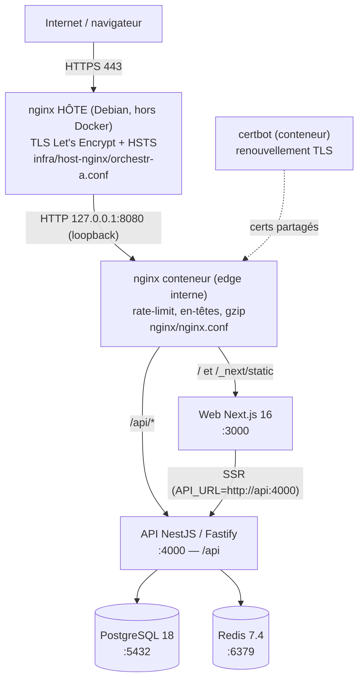

# DEX-00 — Sommaire & architecture d'exploitation

> **Dossier d'exploitation (DEX) d'ORCHESTR'A V2.** Point d'entrée de toute la
> documentation d'exploitation. Public : équipe d'exploitation / infogérance.
>
> **Méthode** : ce dossier est **dérivé du dépôt Git** (code, `docker-compose.prod.yml`,
> `nginx/`, `scripts/`, `.github/workflows/`, `packages/`). Tout ce qui dépend de
> l'instance de production en service (et n'est pas vérifiable dans le dépôt) est
> marqué **« À CONFIRMER »** et recensé au §5.

---

## 1. Les 12 documents

| Doc | Sujet |
|---|---|
| **DEX-00** | Sommaire & architecture (ce document) |
| [DEX-01](DEX-01-deploiement-production.md) | Déploiement en production (procédure, RELEASE_SHA, rollback) |
| [DEX-02](DEX-02-referentiel-configuration.md) | Référentiel de configuration (`.env.production`) |
| [DEX-03](DEX-03-exploitation-courante.md) | Exploitation courante (start/stop, logs, gestes fréquents) |
| [DEX-04](DEX-04-sauvegarde-restauration.md) | Sauvegarde & restauration |
| [DEX-05](DEX-05-supervision.md) | Supervision (health, métriques, journalisation) |
| [DEX-06](DEX-06-securite-exploitation.md) | Sécurité d'exploitation (auth, RBAC, en-têtes, secrets) |
| [DEX-07](DEX-07-base-de-donnees.md) | Base de données (schéma, migrations, rôles) |
| [DEX-08](DEX-08-incidents-depannage.md) | Incidents & dépannage |
| [DEX-09](DEX-09-pra-pca.md) | PRA / PCA (reprise & continuité) |
| [DEX-10](DEX-10-mco-maintenance.md) | MCO / maintenance |
| [DEX-11](DEX-11-acces-exploitants.md) | Accès & exploitants |

---

## 2. En deux phrases

ORCHESTR'A V2 est une application de gestion de projets et RH pour collectivités
territoriales (monorepo Turborepo, licence MIT). Elle se déploie en **5 conteneurs Docker**
(PostgreSQL, Redis, API NestJS, Web Next.js, nginx) derrière un **nginx hôte** qui termine
le TLS.

---

## 3. Architecture des composants

### Composants (source : `docker-compose.prod.yml`)

| Service | Image | Conteneur | Port interne | Rôle |
|---|---|---|---|---|
| postgres | `postgres:18-alpine` | `orchestr-a-postgres-prod` | 5432 (`expose`) | Base de données |
| redis | `redis:7.4-alpine` | `orchestr-a-redis-prod` | 6379 (`expose`) | Cache / files / verrous |
| api | build `apps/api/Dockerfile` | `orchestr-a-api-prod` | 4000 (`expose`) | Backend NestJS/Fastify |
| web | build `apps/web/Dockerfile` | `orchestr-a-web-prod` | 3000 (`expose`) | Frontend Next.js (SSR) |
| nginx | `nginx:1.27-alpine` | `orchestr-a-nginx-prod` | 80/443 sur **127.0.0.1** | Reverse-proxy interne |
| certbot | `certbot/certbot` | `orchestr-a-certbot-prod` | — | Renouvellement TLS (boucle 12 h) |

- **Réseau** : `orchestr-a-network-prod` (bridge). Seul `nginx` publie des ports, et
  **uniquement sur `127.0.0.1`** (`HTTP_PORT:-80`/`HTTPS_PORT:-443`). Le edge public est le
  **nginx hôte** (cf. [DEX-06](DEX-06-securite-exploitation.md)). Le rebind loopback a fermé
  l'exposition directe de `:8080` (cutover c47dd3f0).
- **Volumes nommés** : `orchestr-a-postgres-data-prod`, `…-redis-data-prod`,
  `…-api-logs-prod`, `…-api-uploads-prod`, `…-nginx-logs-prod`, `…-certbot-certs`,
  `…-certbot-www`.
- **Durcissement** : `no-new-privileges` partout, `cap_drop: ALL` sur api+web, limites
  CPU/mémoire par service, `restart: unless-stopped`.

### Pile technique (source : `package.json`, `CLAUDE.md`)

- **API** : NestJS 11 + Fastify 5, Prisma 6, Node ≥ 22. **Web** : Next.js 16 (App Router),
  React 19, TanStack Query, Zustand, Tailwind 4, Radix UI.
- **Données** : PostgreSQL 18, Redis 7.4. **Build** : Turborepo, pnpm 9.15.9.
- **API** : ~107 endpoints sur **35 contrôleurs** (Swagger `/api/docs`, désactivé par défaut
  en prod). À ne pas confondre avec les **107 permissions atomiques** du catalogue RBAC
  (cf. [DEX-06](DEX-06-securite-exploitation.md)).

---

## 4. Flux de données (résumé)

1. Navigateur → **HTTPS** → nginx hôte (TLS, HSTS) → `127.0.0.1:8080` → nginx conteneur.
2. nginx conteneur route `/api/*` → API `:4000`, le reste → Web `:3000`.
3. L'API lit/écrit **PostgreSQL** (rôle runtime restreint `app_user`) et **Redis** (cache de
   permissions, throttling, verrous).
4. Le SSR Next.js appelle l'API en interne via `http://api:4000`.

---

## 5. Registre « À CONFIRMER » (input opérateur requis)

> Ces points dépendent de l'instance en service et **ne sont pas vérifiables dans le dépôt**.
> Ils sont à valider/renseigner par l'exploitant. Référence croisée vers le doc concerné.
> *(Liste des points **majeurs** ; des marqueurs « À CONFIRMER » ponctuels figurent aussi dans
> DEX-04 (uploads dans la sauvegarde), DEX-05 (seuil d'alerte TLS) et DEX-09 (cadence d'exercice
> de restauration).)*

| # | Élément | Ce que dit le dépôt | À confirmer | Doc |
|---|---|---|---|---|
| C1 | **Hôte de production** | domaine `orchestr-a.com` (nginx) | Adresse/again d'accès du VPS, utilisateur de déploiement, chemin (`/opt/orchestra` attendu) — **conserver hors dépôt (coffre)** | DEX-01 |
| C2 | **Automatisation des sauvegardes** | `setup-cron-backup.sh` → cron `0 2 * * *`, **chemin dev** codé en dur | Mécanisme réel (cron **ou** timer systemd), horaire, rétention | DEX-04 |
| C3 | **Rétention des sauvegardes** | 30 j (`backup-database.sh`) | Valeur réellement appliquée en prod | DEX-04 |
| C4 | **Rôle DB des scripts backup/restore** | `-U postgres` codé en dur | Le superuser prod est `orchestr_a` (cf. `.env.production.example`) → les scripts tels quels peuvent échouer | DEX-04/07 |
| C5 | **RTO / RPO** | — | Objectifs de reprise/perte de données | DEX-09 |
| C6 | **Supervision / alerting** | `/api/metrics` (format Prometheus), `/api/health` | Existe-t-il un Prometheus/Grafana ? seuils ? destinataires d'alerte ? | DEX-05 |
| C7 | **Rapport d'erreurs** | `NoopErrorReporter` (stdout) par défaut ; `SENTRY_DSN` optionnel | Backend de tracking activé ? | DEX-05 |
| C8 | **E-mail (SMTP)** | bloc `SMTP_*` commenté (optionnel) | Notifications e-mail activées ? | DEX-02 |
| C9 | **Exploitants & contacts** | — | Liste nominative, astreinte, procédure onboarding/offboarding | DEX-11 |
| C10 | **Fenêtres de maintenance** | — | Créneaux autorisés, communication | DEX-10 |

---

## 6. Documents liés (hors exploitation)

- Migration vers le réseau Assurance Maladie (air-gap) : `docs/migration-cnam/00-GUIDE.md`.
- Schéma complet : `packages/database/prisma/schema.prisma`.
- API : Swagger `/api/docs` (en dev).
